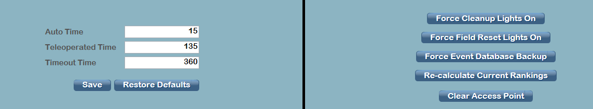

.. _match-play-options:

Options Tab
============

Match timing can be adjusted from this screen, for use in such things as demo matches. Clicking *Restore Defaults* will return all three fields to their season-specific standards.
Select *save* after any adjustments for the timing to take effect. Timing can only be changed prior to Prestart.

* *Timing Items* - Adjust the corresponding time
* *Hide/Unhide Scores in Playoffs* - Hide the red and blue alliance final scores at the end of teleop in Playoff matches
* *Hide Scores* - Hide and unhide red and blue alliance scores on demand
* *Practice Field Mode* - Bypasses some restrictions such as requiring valid scores in order to commit a match

On the right side of the display there are options for some common operations:

* *Force Cleanup Lights On* - When not in-match, force the purple "cleanup" lights to illuminate and indicate field staff may begin clearing the field. Cannot be used once the green lights are on (or in games where cleanup lights are not applicable).
* *Force Field Reset Lights On* - When not in-match, force the green field reset lights to illuminate and indicate to teams and field staff that the field is "safe to enter"
* *Awards Mode* - Change the state of lights and motors on the field into a photogenic mode worthy of the awards ceremony
* *Force Event Database Backup* - Force a copy of the event database to be made and written to the USB Drive specified in :doc:`Settings <../settings/backup-config>`
* *Re-calculate Current Rankings* - Runs all teams through the calculator for the given tournament phase
* *Re-calculate District Rankings* - Runs all teams through the calculator for the distirct rankings at the selected event
* *Clear Access Point* - Remove the team number programming from the AP (does not change the 2.4 GHz radio). Useful in situations where a team needs to connect to their machine, but the AP is currently programmed to their team number (such as between finals matches)
