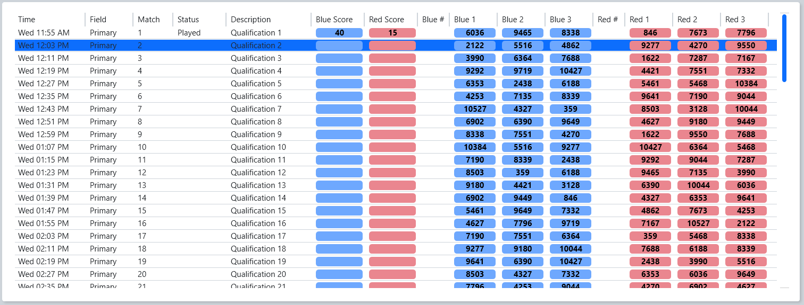

.. _match-play-schedule:

Schedule Tab
=============

Currently active tournament level schedule, in match number order. To play a Match, click on it in the list (the list is disabled once Pre-Start is complete).
The event will automatically advance to the next unplayed Match at the conclusion of each Match (no need to "re-click" each time). To replay a Match, manually select it from the list and confirm the replay upon Prestart.

* Time - Date/time the Match is scheduled to begin
* Field - Field on which the Match is scheduled to be played
* Match - Number of the Match
* Status - Match Status of one of the following values:

   * Played - Match Complete
   * In Progress - Match Running (on any field)
   * Aborted - Match was canceled or E-stopped
   * (Blank) - Match not yet played

* Description - Short summary of the Match type
* Blue Alliance / Red Alliance:

   * Score - Alliance score (once Match is complete)
   * 1/2/3 - Team numbers in their matching stations

.. note::
   The schedule tab remains blank in :doc:`Match Test <match-test>`, which cannot consume a schedule.
