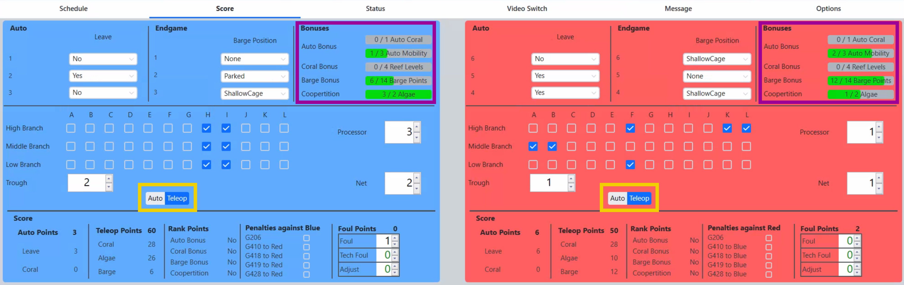
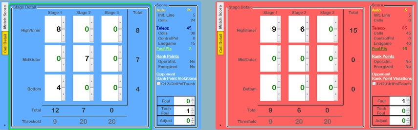
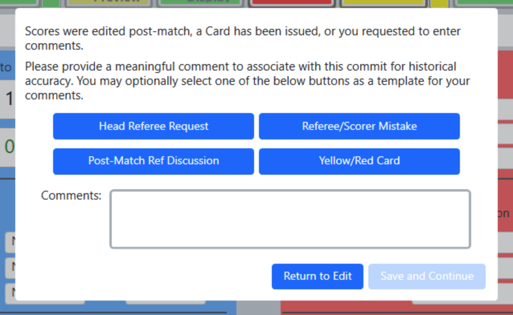

.. _match-play-score:

Score Tab
===========

Game specific field scoring and adjustments.

The Score Tab is the primary location used to confirm the score of the match prior to Commit Score. The information shown on this tab is input by the Referees using the Touchscreens or by the automated scoring system (except in FMS Off-Season).
Scoring value can be manually edited through this interface. The total alliance score is automatically recalculated as these adjustments are made. Values are not editable until after the match is over, 
because values come from the Referees or automation during the match. In FMS Off-Season, values are editable during the match as there are no Referee panels or real time automation.

.. note::
    Be careful if you elect to manually score, or edit scores, using the score tab. There's no edit log until after the first time the score is committed.

At official *FIRST* events, all of the data on the score tab comes from automated hardware or certified Referees. The scorekeeper should not edit any values without the supervision and direction of the Head Referee.

All input values are quantities, not points. It is not necesary for the Scorekeeper to know the underlying score calculations as FMS will automatically convert any quantity inputs to point values.  For additional
information about each scoring element please see the official game manual or consult your Head Referee at your event. Values in the "Bonuses" section (purple box in above image) are read-only progression indicators 
relative to the associated ranking point. The auto/teleop indicator (gold box in above image) automatically changes state at evens with automated scoring, but may need to be manually toggled during score edits or corrections.

.. warning::
    Notice that Major and Minor Foul Pts are points credited to the alliance, which means they're calculated off the other alliance's violations. Changing the Major/Minor Foul counts on a given alliance will change the score of the *opposite* alliance.

Referee Completion Warning
--------------------------

If a Scorekeeper attempts to Commit a score before the Referees have completed their scoring of the match, a warning dialog will be presented.

Post-Match Comments
-------------------

If a match is edited by the scorekeeper after the clock expires, or any cards were assigned in the match, a comment window is automatically opened when the Commit button is pressed on the FCUI.
This box can be used for comments regarding why the score was edited after the match ended and these comments will be saved and available later, should a review be necessary.
The box can also be manually requested using the dropdown arrow on the commit button in the FCUI.

