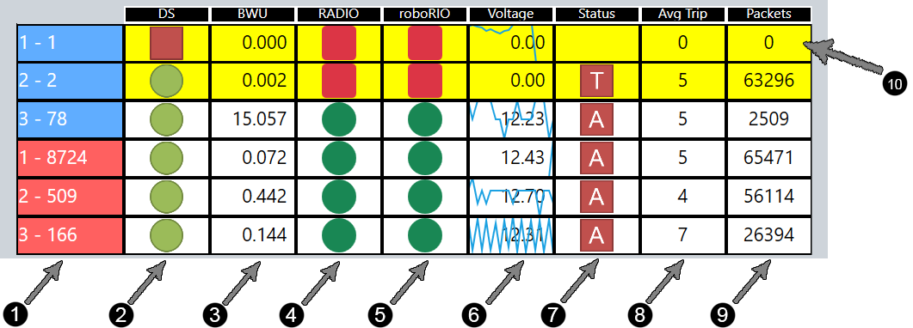

.. _match-play-status:

Status Tab
===========

The Status tab shows detailed information for each robot linked to FMS; this information is also displayed on the Field Monitor used by the FTA and FTA Assistant (FTAA).
The same data is collected for all stations.

.. note::
   This section only covers high-level information, as the display is covered in full detail in the :doc:`Web Field Monitor <../../field-monitor/live/index>` section. Within FMS 
   only the "detailed" version of the Field Monitor is available. For the "Simple" version please use the web based Field Monitor.

#. Station and Team number (in the format station - team)
#. DS - Driver Station
#. BWU - Bandwidth Utilization/Consumption and airtime information
#. Radio - Status of the radio on the robot
#. RIO - Status of the roboRIO on the robot
#. Battery - Battery voltage reported by the Robot (12-13 is normally a fully charged battery, under ~9 may result in visible performance problems).The background of this cell will be a line indicating relative battery voltage over a short sample amount of time.
#. Status - The state and mode of the robot
#. Trip Time - average time required to send a message to the robot and have the robot respond (this is basically a ping). Units are in milliseconds. Usually under 10 for most Robots.
#. Packets - indicates the number of packets dropped in the DS-to-Robot link. Typically there are some lost packets. In a very tame wireless environment, this number will be less than 100 (simulated environment results in large value in example photo)
#. Background Color of Row:

   * "Clear" - Robot connected and ready (or running)
   * Yellow - Robot not connected (A-Stopped, E-Stopped, or any item on the row is "Red", like DS)
   * Brown - Bypassed
   * Says "Move" - Team is in the wrong station and should "Move" (usually, stations 1 and 3 are reversed)
   * Says "Waiting" - Team is not in this match ("Wrong Match") or the previous match has not been finalized and therefore the DS is "Waiting"

.. note::
   It is important to remember that items can only "go green" if the items to the left of it are already "green." For instance, a roboRIO will not be green unless the Radio is already green. This aids in the speed of troubleshooting.
