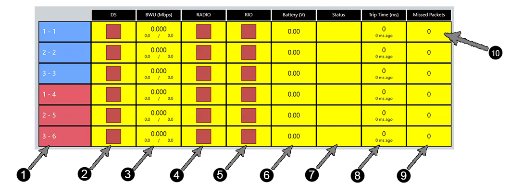

.. _match-play-status:

Status Tab
===========

The Status tab shows detailed information for each robot linked to FMS; this information is also displayed on the Field Monitor used by the FTA and FTA Assistant (FTAA).
The same data is collected for all stations.

#. Station and Team number (in the format station: team)
#. DS:

   * Red square - nothing connected
   * Green circle with X - Indicates if a DS is physically connected to the switch at the SCC  
   * Solid green circle - DS is in FMS mode (i.e. connected to FMS)

#. BWU - Indicates the Bandwidth Utilization/Consumption for that particular team (should be under 2-3 for almost all teams, and FRC rules allow a maximum of 4)
#. Radio - Indicates that the DS is able to communicate with the radio on the robot
#. roboRIO - Indicates that the DS is able to communicate with the roboRIO on the robot
#. Voltage - Battery voltage reported by the Robot (12-13 is normally a fully charged battery, under ~9 may result in visible performance problems).The background of this cell will be a line indicating relative battery voltage over a short sample amount of time.
#. Enabled/Mode - The state and mode of the robot.

   * "A" - Autonomous
   * "T" - Teleoperated
   * Red square - robot is disabled
   * Green circle - enabled
   * Black diamond "A" - Robot is A-Stopped
   * Black diamond "E" - Robot is E-Stopped
   * Blank - No Robot connected

#. Avg Trip - average time required to send a message to the robot and have the robot respond (this is basically a ping). Units are in milliseconds. Usually under 10 for most Robots.
#. Packets - indicates the number of packets dropped in the DS-to-Robot link. Typically there are some lost packets. In a very tame wireless environment, this number will be less than 100 (simulated environment results in large value in example photo)
#. Background Color of Row:

   * "Clear" - Robot connected and ready (or running)
   * Yellow - Robot not connected (A-Stopped, E-Stopped, or any item on the row is "Red", like DS)
   * Brown - Bypassed
   * Says "Move" - Team is in the wrong station and should "Move" (usually, stations 1 and 3 are reversed)
   * Says "Waiting" - Team is not in this match ("Wrong Match") or the previous match has not been finalized and therefore the DS is "Waiting"

.. note::
   It is important to remember that items can only "go green" if the items to the left of it are already "green." For instance, a roboRIO will not be green unless the Radio is already green. This aids in the speed of troubleshooting.
