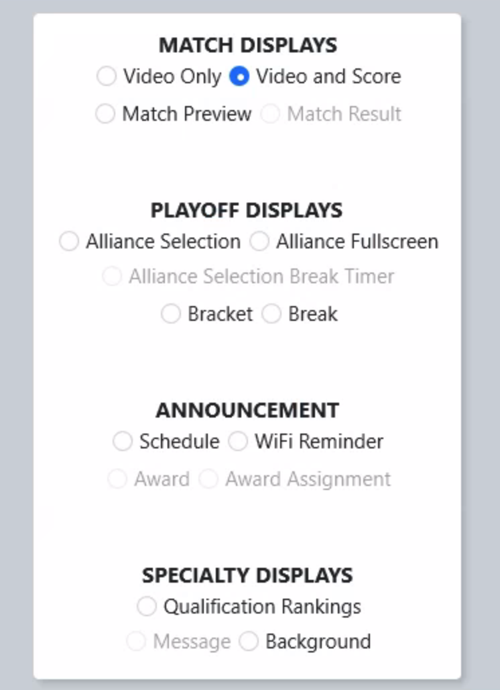

.. _match-play-tabs:

Tabs
===========

The bottom of the Match Play interface has a display window with a number of tabs:

* *Schedule* - displays the currently active schedule
* *Score* - displays the counts for various scoring elements as they are entered by referees or collected from automated scoring components on the field (:doc:`score tab <score-tab>`)
* *Game Details* - displays detailed information specific to the game (if applicable, :doc:`game specific <game-detail-tab>` )
* *Status* - displays connection information on all the robots current on the playing field (see :doc:`status tab <status-tab>`)
* *Video Switch* - manual interface used to control the Audience Display(s)
* *Message* - display messages on the Background of the Audience Display(s)
* *Options* - configuration options

Many of these tabs are described in detail below. Status and Score tabs are not described in this article but rather in later articles.

Schedule
--------

.. image:: images/tabs-1.png

Currently active tournament level schedule, in match number order. To play a Match, click on it in the list (the list is disabled once Pre-Start is complete).
The FCUI will automatically advance to the next unplayed Match at the conclusion of each Match (no need to "re-click" each time). To replay a Match, manually select it from the list and confirm the replay upon Prestart.

* Time - Date/time the Match is scheduled to begin
* Field - Field on which the Match is scheduled to be played
* Match - Number of the Match
* Status - Match Status of one of the following values:

   * Played - Match Complete
   * In Progress - Match Running (on any field)
   * Aborted - Match was canceled or E-stopped
   * (Blank) - Match not yet played

* Description - Short summary of the Match type
* Blue Alliance / Red Alliance:

   * Score - Alliance score (once Match is complete)
   * 1/2/3 - Team numbers in their matching stations

Video Switch
------------

The Video Switch tab is used to manually change the state of the Audience Display(s). See :doc:`Audience Display <../../audience-display/displays/index>` Screens for more details on each option.
Select on this interface, via the radio buttons, which screen to show to the Audience (i.e. which screen is active in the Audience Display). It also informs which screen is currently being shown.
Several displays are not selectable via this interface, but serve to inform the user when these are the current active screens (such as Match Results, which must be triggered through the FCUI or Match Review).

.. note::
   Selecting a display here will make all instances of the Audience Display change

Message
-------

.. image:: images/tabs-3.png

Messages can be displayed on all Audience Display instances by typing a message and selecting *Send Message*.
To remove the text from the Audience Display use the *Clear Message* button. Messages will be displayed on all instances of Audience Display running on the FMS Network.

Options
-------

Match timing can be adjusted from this screen, for use in such things as demo matches. Clicking *Restore Defaults* will return all three fields to their season-specific standards.
Select *save* after any adjustments for the timing to take effect. Timing can only be changed prior to Prestart.

On the right side of the display there are options for some common operations:

* *Force Cleanup Lights On* - When not in-match, force the purple "cleanup" lights to illuminate and indicate field staff may begin clearing the field. Cannot be used once the green lights are on.
* *Force Field Lights On* - When not in-match, force the green field reset lights to illuminate and indicate to teams and field staff that the field is "safe to enter"
* *Awards Mode* - Change the state of lights and motors on the field into a photogenic mode worth of the awards ceremony
* *Force Event Database Backup* - Force a copy of the event database to be made and written to the USB Drive specified in :doc:`Settings <../settings/backup-config>`
* *Re-calculate Current Rankings* - Runs all teams through the calculator for the given tournament phase
* *Re-calculate District Rankings* - Runs all teams through the calculator for the distirct rankings at the selected event
* *Clear Access Point* - Remove the team number programming from the AP (does not change the 2.4 GHz radio). Useful in situations where a team needs to connect to their machine, but the AP is currently programmed to their team number (such as between finals matches)
