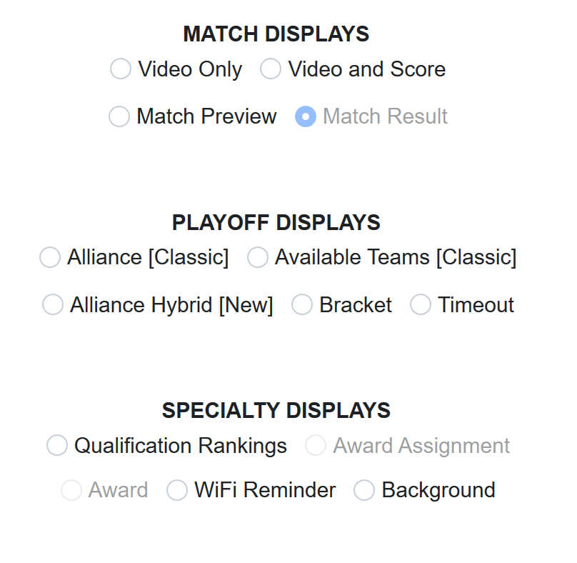

.. _match-play-video-switch:

Video Switch Tab
=================

|
| The Video Switch tab is used to manually change the state of the Audience Display(s). See :doc:`Audience Display <../../audience-display/displays/index>` Screens for more details on each option.
   Select on this interface, via the radio buttons, which screen to show to the Audience (i.e. which screen is active in the Audience Display). It also informs which screen is currently being shown.
   Several displays are not selectable via this interface, but serve to inform the user when these are the current active screens (such as Match Results, which must be triggered through Match Play or Match Review).

.. note::
   Selecting a display here will make all instances of the Audience Display change.
