Interface
=========

Match Play
----------

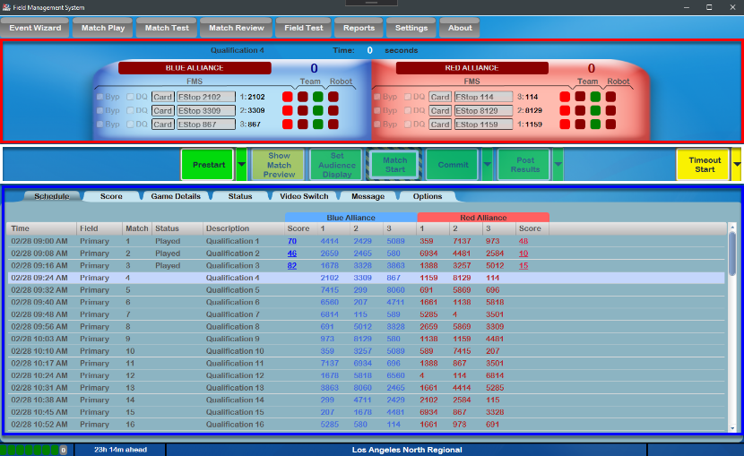

Match Play (and Match Test) are the most commonly used environments during an FRC event. The screen is used to start and stop matches, disable robots, and control the Audience Display.

[Red] The top part of the screen shows the current match number, match time, score for the alliances and detail by station. Match time is updated in real time and will correspond with the same information shown on the LED Displays. The status of the robots at each end of the playing field is communicated to FMS by the SCCs and DSs. The color of each box corresponds to each end of the playing field, blue for the Blue Alliance, and red for the Red Alliance. Each box includes information on the status of the three robots on each alliance ( `described later <../../eventmanager/l/608578-interface#>`_ )

[White] Match Control is handled using the buttons in the center of the Match Play and Match Test screens ( `described later <../../eventmanager/l/608578-interface#>`_ )

[Blue] The lower portion of the screen changes based on the selected tab to display schedule information, detailed scoring, and more (described later)

Station Status
--------------

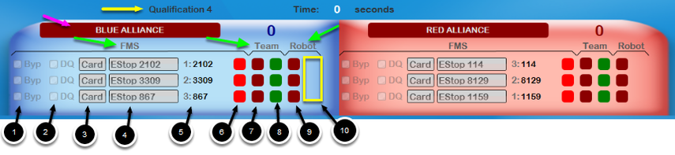

.. image:: images/interface-3.png

Match number and timing information is shown at the very top of the display (yellow arrow), with time represented in total seconds (not min:sec) to match the timers on the field. The background of the "Blue Alliance" and "Red Alliance" fields (indicated by the pink arrow) will turn from Red to Green when there is a known ready state for all Robots on that Alliance (connected or bypassed). In order for a match to start, both Alliance backgrounds must be Green (known state for all Robots on the Field).

Additionally along the top bar of Match Play is detailed station information- the background color indicates the alliance (Red or Blue) and the number near the textbox indicates the station (1 to 3). The information for each Alliance is broken down into three groups, FMS, Team, and Robot (based on the titles indicated by the green arrow). Markers in the graphic are shown for Blue Alliance, though the layout is the same for the Red Alliance.

FMS

Controls to inform FMS which robot in the indicated station position and how to handle it:

#. Byp - Select this box to bypass this particular station and force it to a ready (but disabled) state.#. DQ - Select this box to indicate that the corresponding team has been DQ’d for this match (will also cause Bypass)#. Card State (entered by Head Referee, can only be edited after Match is over): Green - no card, team in good standing Yellow - team has been assigned a yellow card Red - team assigned a red card in this match. Setting the indicator to red also bypasses the Player Station and automatically assigns the team a DQ for the current match. Note that on its subsequent match, FMS will automatically change the red card to yellow* Green - no card, team in good standing* Yellow - team has been assigned a yellow card* Red - team assigned a red card in this match. Setting the indicator to red also bypasses the Player Station and automatically assigns the team a DQ for the current match. Note that on its subsequent match, FMS will automatically change the red card to yellow

Estop - used to Estop the robot during the match. This box also shows the team number that it will Estop, for quicker reference.Team Number - The team number which corresponds with the team designated to play in this station. Teams need to be in the correct station to ensure that they receive the proper Station ID and Position information from FMS.WPA Key status: Red - team has not been on the playing field Yellow - has linked with the field, but has not played in a match Green - the team has played in a match on the field* Red - team has not been on the playing field* Yellow - has linked with the field, but has not played in a match* Green - the team has played in a match on the field

Team

Indicates the state of the DS:

#. Left bubble - Indicates status of the FMS-to-DS link. If the team number and DS match, this bubble with be green.#. Right bubble - Indicates status of the E-stop. If this light is green, the E-stop in the Team’s Player Station is up. If it is red, the E-stop in the Player Station is down, or the Estop button on FMS has been pressed. An E-stop in the down position will cause the amber light in the Team Station to turn on. All E-stops need to be in the up position to begin a match. Prestarting a match with any E-stop down will prompt a dialog box to be shown indicated in which Player Station the E-stop(s) are down.* All E-stops need to be in the up position to begin a match. Prestarting a match with any E-stop down will prompt a dialog box to be shown indicated in which Player Station the E-stop(s) are down.

Robot

Indicates the state of the Robot:

#. Left bubble - DS-to-Robot link status. If the DS and Robot are linked, this bubble will be green. If the station has been Bypassed, a “B” will appear in this bubble. If no link is established, the Team Light in the Player Station will flash at 1Hz (1 time per second) rate.#. Right bubble - Indicator would display in yellow marked area, but only shows when a Robot is connected. Mode and System state of the Robot. “A” indicates Autonomous Mode, “T” indicates Teleoperated mode. If the Robot is disabled, the bubble is red, it will be green when the Robot is enabled by FMS.

Match Control (FCUI)
--------------------

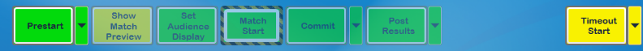

.. image:: images/interface-5.png

The buttons in the middle section are used to step through the Match process. In order to be available for use, a match must be selected from the Schedule tab. This bar is commonly referred to as the "FCUI" or Field Control User Interface (which came from the former version, which was a piece of hardware on the scoring table). Details on each button are as follows:

* *Prestart* - used to prep the field for the upcoming match. Prestart configures the field hardware for the upcoming match. *In Match Test/Practice matches, clicking Prestart will allow for entry of team numbers (in 4-team-alliance playoff matches this is also used to move teams between stations)* *Prestart can be cancelled if necessary while it's running* *Additional options are outlined below** *In Match Test/Practice matches, clicking Prestart will allow for entry of team numbers (in 4-team-alliance playoff matches this is also used to move teams between stations)** *Prestart can be cancelled if necessary while it's running** *Additional options are outlined below*

*Show Match Preview -* displays the Match Preview screen with team names and current ranking data for teams in the upcoming match*Set Audience Display -* this button updates the Audience screen with the teams for the match*Match Start -* used to start the match ( *MUST ONLY BE USED WHEN THE FIELD IS IN A SAFE STATE AND NO HUMANS ARE IN DANGEROUS POSITIONS. FTA MUST GIVE PERMISSION FOR A MATCH TO START!* ) *Match Cancel -* use this same button to cancel a match in progress (button text changes after start)* *Match Cancel -* use this same button to cancel a match in progress (button text changes after start)

*Commit -* confirm the score of the match and write the details to the database*Post Results -* trigger the Audience screen and show the final scores and updated Rankings for the teams in the match *Additional options are outlined below** *Additional options are outlined below*

Timeout Start - initialize or end a timeout and show the timing information on the Audience Display and on field LED displays. Length of a Timeout can be changed on the "Options" tab. *Additional options are outlined below** *Additional options are outlined below*

Abort Match Option
------------------

Once a match has started, the "Start Match" option becomes "Abort Match" as shown, which requires confirmation before ending a Match in progress.

Prestart Dropdown
-----------------

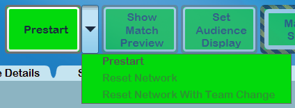

The Prestart button has additional options available via a dropdown. Details on each dropdown option are as follows:

* *Prestart* - this is the "typical" Prestart process, as outlined in the previous section* *Reset Network -* allows for re-programming of the field network hardware without a full "Prestart" (In 2019, this avoids dumping Cargo out of the Cargoships when making network adjustments)* *Reset Network With Team Change -* allows for re-programming of the field network hardware while also changing a team in one or more stations

Prestart Dropdown in Match Test/Practice
----------------------------------------

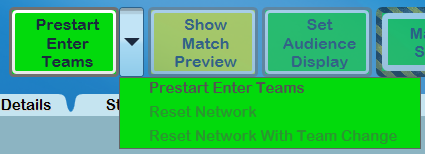

In Match Test, Practice Matches and Playoff Matches that are 4-team-alliances, the Prestart button replaces "Prestart" with "Prestart Enter Teams"

* All other options work as described previously. Selecting Prestart Enter Teams will prompt for team numbers to participate in the match, as shown below. If teams were scheduled for the Match, they would be pre-populated in the display.

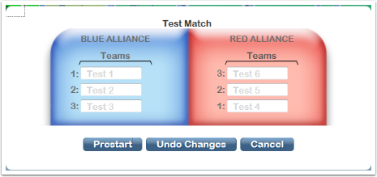

.. image:: images/interface-13.png

Commit Dropdown
---------------

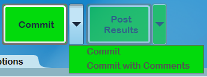

The Commit button has additional options available via a dropdown. Details on each dropdown option are as follows:

* *Commit* - traditional path of committing scores as final* *Commit with Comments -* allows for Scorekeeper to enter a comment before the scores are committed

At official events, if the scores were edited by the Scorekeeper after the match, a comment will be required regardless of selection. A comment is also required if any team was assigned a card. If required or requested, a box will appear during the commit process. Select from the template buttons as a starting point for comments or type freely in the provided box.

.. image:: images/interface-16.png

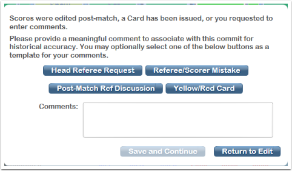

Post-Results Dropdown
---------------------

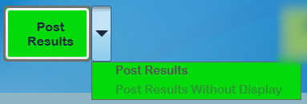

.. image:: images/interface-19.png

The Post-Results button has additional options available via a dropdown. Details on each dropdown option are as follows:

* *Post Results* - traditional path of posting results from the Match to the Audience Display* *Post Results Without Display -* allows for posting of results from the Match without changing the Audience Display

Timeout Dropdown
----------------

.. image:: images/interface-20.png

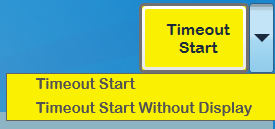

The Timeout button has additional options available via a dropdown. Details on each dropdown option are as follows:

* *Timeout Start* - start a timeout with the given length according to the "Options" tab* *Timeout Start without Display -* start a timeout without changing the Audience Display

In Playoff matches, starting a timeout will prompt for additional information about the associated source of the timeout. The countdown clock will not start until the source is selected and Start Timeout is pressed.

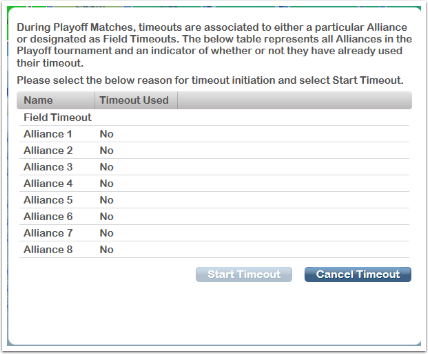

.. image:: images/interface-23.png

Alternate Flow
--------------

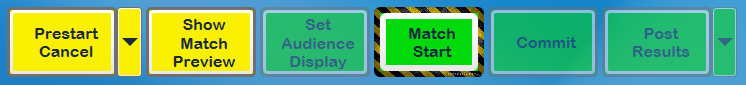

Some elements of the FCUI have alternate flows. Above are examples are alternate flows for "Show Match Preview," clicking an alternate (yellow) button will return the FCUI to that step. Also shown is the style for Match Start, which has additional highlighting due to the dangerous nature of enabling robots and starting a Match.

