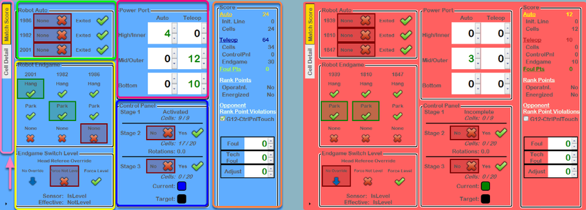
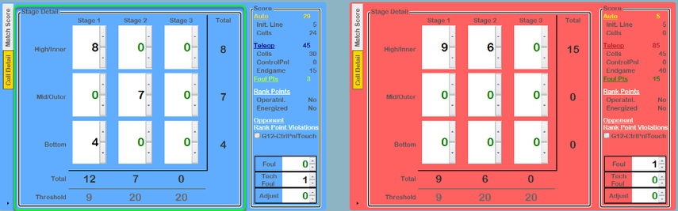
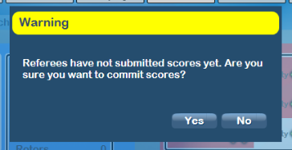
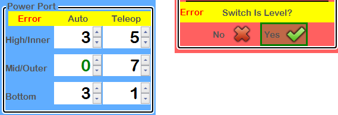
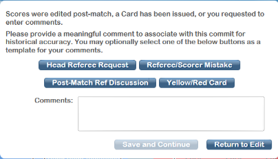

Score Tab
=========

Game specific field scoring and adjustments.

Score Tab - Page 1
------------------

The Score Tab is the primary location used to confirm the score of the match prior to Commit Score. The information shown on this tab is input by the Referees using the Touchscreens or by the automated scoring system (except in FMS Off-Season).

Manually editing these values can be done through this interface. The total alliance score is automatically recalculated as these adjustments are made. Values are not editable until after the match is over, because values during the match come from the Referees or automation. In FMS Off-Season, values are editable during the match as there are no Referee panels or real time scores.

Be careful if you elect to manually score, or edit scores manually, using the score tab!

Documentation will show the blue Alliance, but the functionality is the same for the red Alliance. At official *FIRST* events, all of the data on the score tab comes from automated hardware or certified Referees. The scorekeeper should not edit any values without the supervision and direction of the Head Referee.

Light Pink Box / Arrow - The area of the tab highlighted above in light pink is the score tab navigation. With the large amount of scoring data, multiple tabs are used to demonstrate various portions of the Match. Clicking a tab will change the visible page (each Alliance can be on a different tab).

Green Box - The area of the tab highlighted above in green is for scoring of Robots in Autonomous mode. This data typically comes from the Referee panels, and a selection is required for each Robot before submitting scores.

Yellow Box - The area of the tab highlighted above in yellow is the endgame scoring of Robots. This data typically comes from the Referee panels, and a selection is required for each Robot before submitting scores. Below the robots is the control for the Generator Switch level. The state of the sensor on the field is displayed under the Sensor spot, along with the effective (or calculated) level value (used to score the endgame). Under direction of the Head Referee, this could be changed to accommodate other scenarios using the Head Referee Override.

Magenta Box - The area of the tab highlighted above in magenta is the power cell scoring by phase. This data typically comes from the automation system on the field, automatically broken out by Auto and Teleop as well as which Power Port.

Dark Blue Box - The area of the tab highlighted above in dark blue is the scoring of the control panel. This data typically comes from the automation system on the field, automatically broken out by stage. The only editable data for the control panel is the completion state of yes/no for Stage 2 or 3, the other data is displayed for information only purposes for the Scorekeeper / Head Referee. "Rotations" under stage 2 shows partial progress towards completion of the "spin" task on the control panel. The Current/Target fields under Stage 3 show both the assigned target color for the alliance (or black for unassigned/not applicable) as well as the color currently being read by the sensor.

Orange Box - The area of the tab highlighted above in orange is the score summary. All values in this box are in points, converted from the data in the other areas of the Alliance's score tab, except for the Foul/TechFoul boxes, which are counts. The ranking points area is always shown, but there are no ranking points in Practice/Playoff/Test matches, so they will always say No.

* Notice that Foul Pts, written in green, are points credited to the alliance, which means they're calculated off the other alliance's violations. Changing the Foul/TechFoul counts on a given alliance will change the score of the *opposite* alliance.* The 2020 game has a violation that results in the opposing Alliance receiving a Ranking Point. This is shown through the "Opponent Rank Point Violations" checkbox. The Ranking Point is credited to the Alliance where the checkbox is checked. For example, if the "G12-CtrlPnlTouch" is checked in the blue Alliance scoring area, blue Alliance will receive the Ranking Point (meaning red Alliance committed the violation).

Score Tab - Page 2
------------------

.. image:: images/score-tab-2.png

The Score Tab is made up of sub-pages. Some data is shared between sub-pages, see previous section for details on those portions of the tab.

Green Box - The area of the tab highlighted above in green is for power cell scoring by stage. For each stage 1, 2 and 3, the associated number of power cells scored in the bottom, outer and inner port is shown. All values are counts, the associated calculated points are shown on the summary bar.

To the right and bottom of the boxes are calculations of the total counts entered, as well as the corresponding "threshold" values for that match (a requirement related to the control panel / stage activation).

Before a score can be committed, the number of power cells scored in each stage / port must be matching between this page (the stage detail) and the previous page (the general score detail).

Referee Completion Warning
--------------------------

.. image:: images/score-tab-4.png

If a Scorekeeper attempts to Commit a score before the Referees have completed their scoring of the match, a warning dialog will be presented.

Missing Hardware Warning
------------------------

.. image:: images/score-tab-7.png

During official events, if FMS believes that scoring hardware is unavailable, it will add a warning message to the corresponding elements. Hover text is available on most elements and provides additional detail.

Post-Match Comments
-------------------

If a match is edited by the scorekeeper after the clock expires, or any cards were assigned in the match, a comment window is automatically opened when the Commit button is pressed on the FCUI. This box can be used for comments regarding why the score was edited after the match ended, and these comments will be saved and available later, should a review be necessary. The box can also be manually requested using the dropdown arrow on the commit button in the FCUI.

