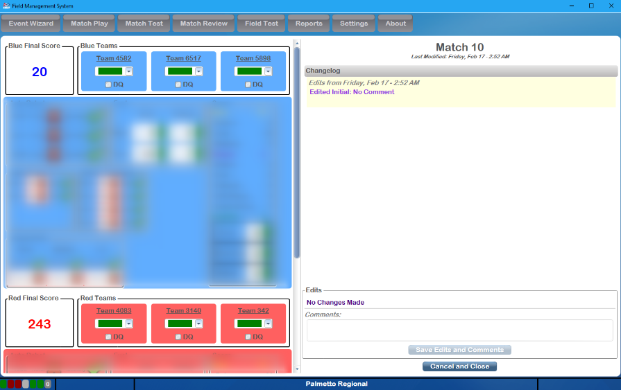

.. _match-review-edit:

Edit Match
======================

Fix scores from a given match.

Match Edit
----------

Match Reviews' Edit Match functionality provides all the relevant information for a match; all scoring elements, total calculated score, foul points, etc. Check boxes indicate if the DQ option was used, and the color in the drop-down under each team number indicates if that team received a Yellow or Red Card during the match.

If editing is necessary, simply change values within the interface on the left side of the screen. The blue alliance scoring actions will always be on top, with a blue background. The red alliance scoring actions will always be on bottom, with a red background. The scores/rankings will be immediately recalculated on save. If any edits are made, a comment with the reasons is required, and this information is reported to *FIRST* HQ.

On the right side of the screen, a history of edits is displayed. With the most recent on top, the "Changelog" will list all edits and comments as they were entered. If a comment was added before commit, it will be listed next to the "Edited Initial" purple title on the Changelog.

Changes made in Match Review take effect immediately once they are saved, and cannot be reversed (without opening and manually undoing the edits). In the Playoffs, matches cannot be edited once that level of the Playoffs is over (i.e. Quarterfinals are locked once the Semifinals have started).

Clicking Cancel will close with window with no changes being saved.

