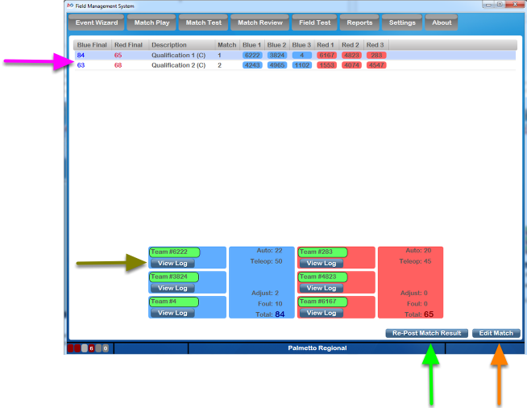

.. _match-review-match-review:

Match Review
======================

Window
------

The Match Review interface is used to review all match history for the currently active schedule. Match Review allows the Scorekeeper to edit the results of matches to ensure team rankings and advancement are calculated correctly. The buttons and info on the lower portion of the display depend on the selected match. Click a match, or use the arrow keys, to change which match is currently selected.

[ *Pink* *Arrow* ] Only completed matches are displayed, un-played or canceled matches are not visible in Match Review. Final scores, match info and team numbers are all available

[ *`Gold <../../eventmanager/l/607779?data-resolve-url=true&data-manual-id=59333>`_* *`Arrow <../../eventmanager/l/607779?data-resolve-url=true&data-manual-id=59333>`_* ] Pressing the "View Log" button under a given team will show their detailed statistics for that match

[ *Green* *Arrow* ] Re-posting the match result will trigger the Audience Display to show the results of the selected match (especially useful after making an edit)

[ *`Orange <../../eventmanager/l/607778?data-resolve-url=true&data-manual-id=59333>`_* *`Arrow <../../eventmanager/l/607778?data-resolve-url=true&data-manual-id=59333>`_* ] Edit the selected match, should only be done under the guidance and supervision of FTA/Head Referee

