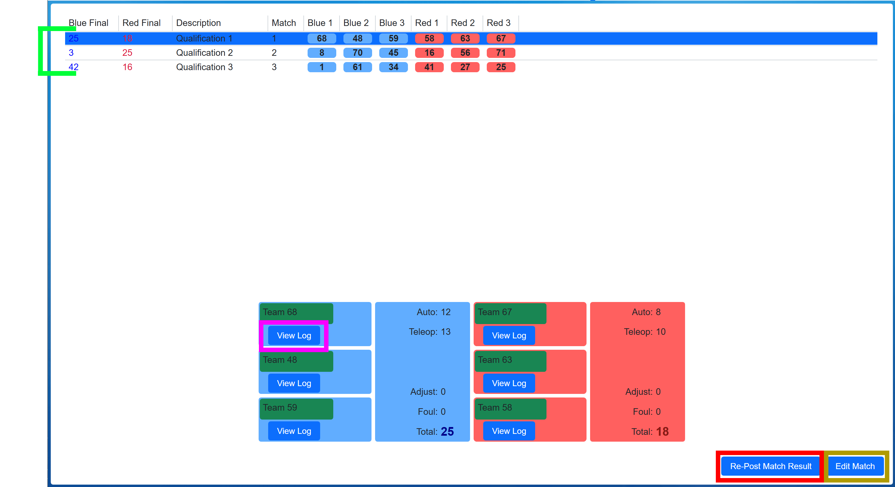

.. _match-review-match-review:

Match Review
======================

Window
------

The Match Review interface is used to review all match history for the currently active tournament level. Match Review allows the Scorekeeper to edit the results of matches to ensure team rankings and advancement
are calculated correctly. The buttons and info on the lower portion of the display depend on the selected match. Click a match, or use the arrow keys, to change which match is currently selected.

[*Green Indicator*] Only completed matches are displayed, un-played or canceled matches are not visible in Match Review. Final scores, match info and team numbers are all available

[*Pink Box*] Pressing the ":ref:`match-review-log`" button under a given team will show their detailed statistics for that match

[*Red Box*] Re-posting the match result will trigger the Audience Display to show the results of the selected match (especially useful after making an edit)

[*Gold Box*] The :ref:`match-review-edit` button, which should only be used under the guidance and supervision of FTA/Head Referee, edits all results from the selected match.

