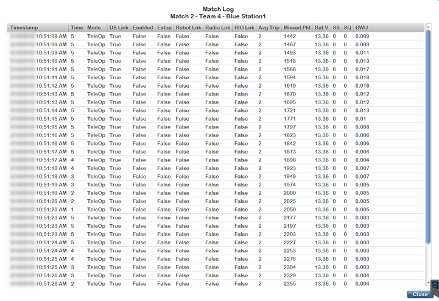

.. _match-review-log:

View Log
===========

Clicking on the “View Log” button below each team number opens a viewer which gives detailed logging information of the team during that particular match. The FMS records data every 500ms for each team, during each match. Details include Mode (Auto or Teleop), DS Link, E-stop condition, and if the robot was enabled or disabled, battery voltage, radio signal level, radio signal-to-noise ratio, and bandwidth usage. Click Close to return to the Match Review screen.

Data shown in the viewer is the same as the data available through the FMS Web Portal.

