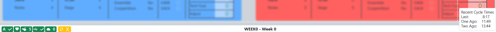

Indicators
==========

Indicators around the main window of Event Manager

Lower bar Indicators
--------------------

.. image:: images/indicators-0.png

[Green Arrow] The bubble indicators relay quick status information about major hardware and software status information on the field. *The bubbles are not displayed in the Off-Season version.* They are:

* SCC Status* Power Port (Goal) Status (Game Specific)* Shield Generator Status (Game Specific)* Control Panel IO Status (Game Specific)* PLC Heartbeat (flashes at 1Hz)* Referee screens (If red, the number of screens missing are displayed)* Backup Status* Sync Status (if red, number of outstanding tasks)

Most items will have a "hover text" to explain the status shown. For most items, green means status is good, red means status is bad, and gray means status is unknown.

[Orange Box] The orange box represents the "ahead behind" timer. Once a match is started, the time difference between when the match was started, and when it was scheduled will be displayed here. Hover over this timer to see recent cycle times.

[Middle Box] The event name is displayed in the middle of the bottom bar.

[Pink Box] When a task that requires additional time is running (such as schedule generation) the "busy bar" will show in this location (example shown).

