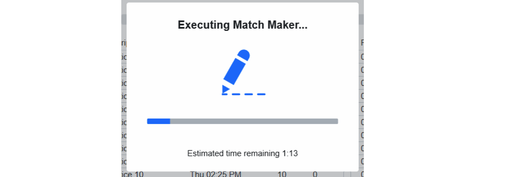

.. _navigation-indicators:

Indicators
======================

Indicators around the main window of Event Manager

Indicator Bar
--------------------

[*Green Box*] The bubble indicators relay quick status information about major hardware and software status information on the field. The bubbles are not displayed in the Off-Season version.

* "S" - SCC Status
* "Heart" - PLC Heartbeat and Arena Light Status (flashes at 1Hz)
* "Whistle" - Referee screen status (If red, the number of screens missing are displayed)
* "Vertical Lines" - Backup Status
* "Cloud" - Sync Status (if red, number of outstanding tasks)
* "Checkmark" - Additional Sync status information

Most items have hover text with additional information. Generally, green means status is good, red means status is bad, and gray means status is unknown and requires attention.

[*Yellow Box*] The "ahead behind" timer displays once at least two matches have been played since FMS was opened. The time difference between when the match was started and when it was scheduled to begin will be displayed here. Hover over this timer to see recent cycle times.

.. note::
        As a general rule of thumb, events should not be operating more than one cycle time ahead of schedule. For example, if your cycle time is 7 miunutes, then your "ahead behind" time should be "7 minutes ahead" or less.

[*Pink Box*] The event name and code are displayed at all times

When a task requires additional time to complete (such as schedule generation) a "busy indicator" will appear and block the screen until the operation completes

