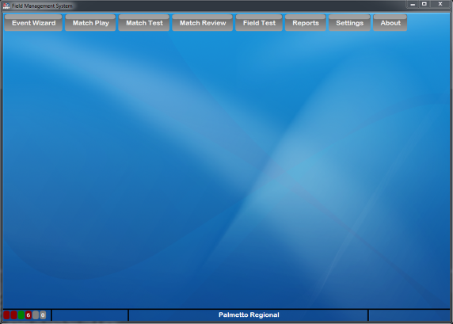

.. _event-wizard-navigation:

Tab Navigation
======================

Navigating between the portions of the event manager

Opening View
------------

The above shows the Event Manager interface when opened for the first time. The different tools are accessed via the tabs along the top of the window. These tools are:

* :ref:`event-wizard-nav` - the main interface for setting up the entire tournament. Creating match schedules, input award winners, generating WPA keys, etc. are all done from this interface
* :ref:`match-play-interface` - the main interface for starting and stopping matches, managing the score, and controlling the information posted to the Audience screen
* :ref:`match-play-test` - the tool used to test the playing field in order to verify proper functionality of all electronics and scoring devices
* :ref:`match-review-match-review` - review or modify the score from a previous match
* :ref:`field-test-field-test` - perform basic initial functionality tests of the playing field (not available in Off-Season version)
* :ref:`reports-home` - generating printable reports such as match schedules, team lists, or printouts for Announcers are all handled through this interface
* :ref:`settings-network-status` - Global settings for the software, as well as Administrative functions
* :ref:`about-tab` - shows the current software version number, allows updates, and shows the EULA

Further details on each function are detailed later in this User Guide.

