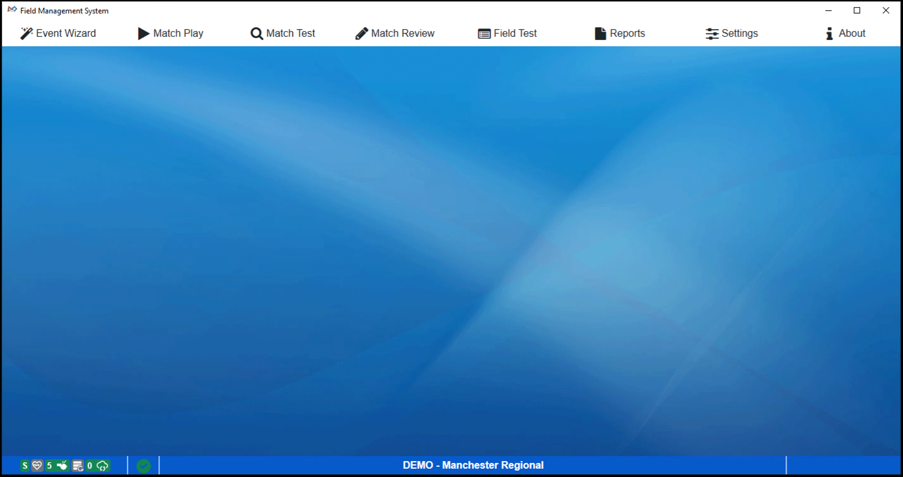

Tab Navigation
==============

Navigating between the portions of the event manager

Opening View
------------

The above shows the Event Manager interface when opened for the first time. The different tools are accessed via the tabs along the top of the window. These tools are:

* *`Event Wizard <../../eventmanager/c/178772?data-resolve-url=true&data-manual-id=59333>`_* - the main interface for setting up the entire tournament. Creating match schedules, input award winners, generating WPA keys, etc. are all done from this interface* *`Match Play <../../eventmanager/c/178773?data-resolve-url=true&data-manual-id=59333>`_* - the main interface for starting and stopping matches, managing the score, and controlling the information posted to the Audience screen* *`Match Test <../../eventmanager/c/178773?data-resolve-url=true&data-manual-id=59333>`_* - the tool used to test the playing field in order to verify proper functionality of all electronics and scoring devices* *`Match Review <../../eventmanager/c/178775?data-resolve-url=true&data-manual-id=59333>`_* - review or modify the score from a previous match* *`Field Test <../../eventmanager/c/178771?data-resolve-url=true&data-manual-id=59333>`_* - perform basic initial functionality tests of the playing field (not available in Off-Season version)* *`Reports <../../eventmanager/c/178776?data-resolve-url=true&data-manual-id=59333>`_* - generating printable reports such as match schedules, team lists, or printouts for Announcers are all handled through this interface* *`Settings <../../eventmanager/c/178774?data-resolve-url=true&data-manual-id=59333>`_* *-* Global settings for the software, as well as Administrative functions* *`About <../../eventmanager/c/179015?data-resolve-url=true&data-manual-id=59333>`_* *-* shows the current software version number, allows updates, and shows the EULA

Further details on each function are detailed later in this User Guide.

