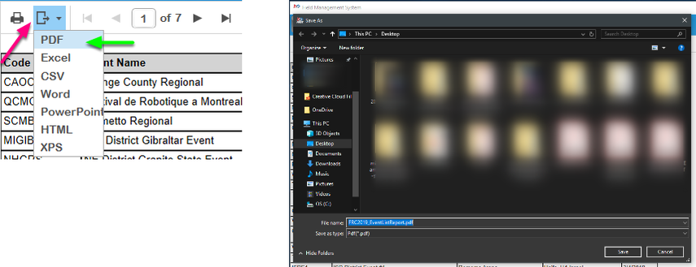
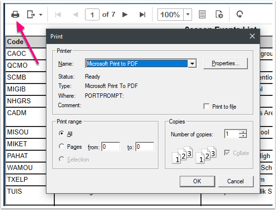

.. _reports-operations:

Report Operations
=================

Exporting
-----------------

To export a report (such as providing an Excel version to a Judge Advisor), first, select the export icon (pink arrow) on the bar above the report name. Second (green arrow) select the file format you wish to export. Selections include Microsoft Excel (Excel), Adobe PDF (PDF) or Microsoft Word (Word). This will (after a short "working" indicator) bring up the standard Windows save dialog (right) where you can select the location to export the report.

Printing
----------------

Print reports by selecting the printer icon on the bar above the report name. This will bring up the standard Windows print dialog where the report can be printed.

