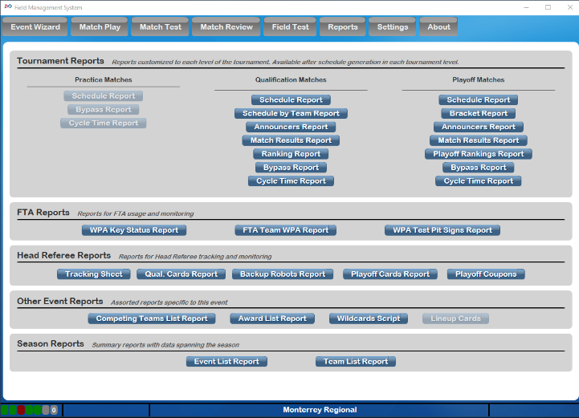
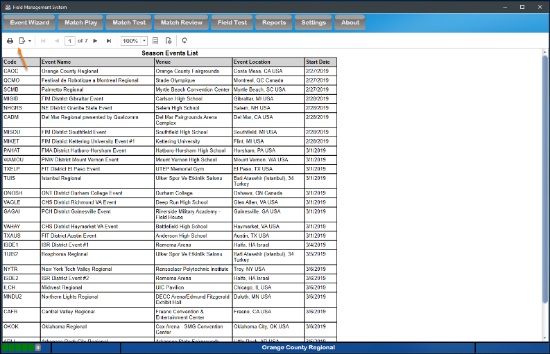
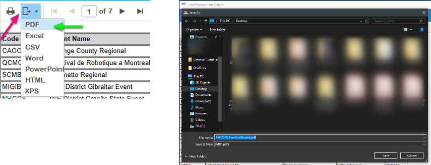

Reports
=======

Retrieve event information through formatted reports.

Menu
----

The Reports screen is used to generate printable reports needed throughout the tournament. Once a report has been generated, several options are available to the user. Printing options can be selected as well as a file-export feature. Reports can be exported in Microsoft Excel, Word, or PDF file formats.

Example Report
--------------

An example report, showing the event list. Report could be formatted (although default formatting should be sufficient) and then printed or saved from this interface using the buttons on the bar indicated above with the orange arrow.

Available Reports
-----------------

Tournament Level Reports:

* Practice Tournament *Schedule* : Current active match schedule *Cycle Time* : This report shows the actual time between match starts *Bypass* : This report shows which teams have been Bypassed during the currently active match schedule

   * *Schedule* : Current active match schedule
   * *Cycle Time* : This report shows the actual time between match starts
   * *Bypass* : This report shows which teams have been Bypassed during the currently active match schedule

* Qualification Tournament *Schedule* : Current active match schedule *Schedule By Team* : Current active match schedule, sorted by team *Announcer’s Report* : detailed report all team details for each match *Match Results* : Final scores of all completed matches in the currently active schedule *Ranking* : Current ranking of all teams as the event *Bypass* : This report shows which teams have been Bypassed during the currently active match schedule *Cycle Time* : This report shows the actual time between match starts

   * *Schedule* : Current active match schedule
   * *Schedule By Team* : Current active match schedule, sorted by team
   * *Announcer’s Report* : detailed report all team details for each match
   * *Match Results* : Final scores of all completed matches in the currently active schedule
   * *Ranking* : Current ranking of all teams as the event
   * *Bypass* : This report shows which teams have been Bypassed during the currently active match schedule
   * *Cycle Time* : This report shows the actual time between match starts

* Playoff Matches *Schedule* : Current active match schedule *Bracket* : Tournament bracket *Announcer’s Report* : detailed report all team details for each match *Match Results* : Final scores of all completed matches in the currently active schedule *Playoff Rankings Report* : Shows the playoff alliances in rank order within the current playoff level and with their ranking detail *Bypass* : This report shows which teams have been Bypassed during the currently active match schedule *Cycle Time* : This report shows the actual time between match starts

   * *Schedule* : Current active match schedule
   * *Bracket* : Tournament bracket
   * *Announcer’s Report* : detailed report all team details for each match
   * *Match Results* : Final scores of all completed matches in the currently active schedule
   * *Playoff Rankings Report* : Shows the playoff alliances in rank order within the current playoff level and with their ranking detail
   * *Bypass* : This report shows which teams have been Bypassed during the currently active match schedule
   * *Cycle Time* : This report shows the actual time between match starts

FTA Reports:

* *WPA Key Status Report* : shows if teams have linked or played in matches successfully
* *FTA Team List WPA* : Same as *WPA Key Status Report* , but with WPA keys shown. Requires FTA password to run.
* *WPA Test Pit Signs Report* : Generates one page per team that has not yet connected to the field, to place in the team’s pit or distribute as reminder

Head Referee Reports:

* *Tracking Sheet:* A sheet used by Head Referees for tracking information throughout the event. Head Referee may request a copy from the Scorekeeper.
* *Qual. Cards* : Match schedule showing teams with assigned cards during Qualification matches
* *Backup Robots* : Report for teams to accept or decline their position as a backup robot
* *Playoff Cards* : Match schedule showing alliances with assigned cards during Playoff matches
* *Playoff Coupons* : Timeout and Backup coupons for Playoffs (includes Team numbers)

Other Event Reports:

* *Competing Teams List Report* : Same as the Season Team List, but filtered to only the teams competing at the currently selected event
* *Awards List* : A list of the awards to be given out at the event. The winners are included if they have been assigned.
* *Awards Eligibility Report* : A report listing all teams attending the event, and their eligibility for certain awards (such as Chairman's Award).
* *Wildcards Script* : Script for Announcer’s should any team generate a Wildcard at the event
* *Lineup Cards* : Lineup sheets for events using the “4 team alliances” playoff style ( *FIRST* Championship)

Season Reports:

* *Event List* : A complete list of all FRC events in the current season (including those manually added events in FMS Off-Season)
* *Team List* : A complete list of all registered FRC Teams for the given season

Exporting Reports
-----------------

To export a report (such as providing an Excel version to a Judge Advisor), first, select the export icon (pink arrow) on the bar above the report name. Second (green arrow) select the file format you wish to export. Selections include Microsoft Excel (Excel), Adobe PDF (PDF) or Microsoft Word (Word). This will (after a short "working" indicator) bring up the standard Windows save dialog (right) where you can select the location to export the report.

Printing Reports
----------------

Print reports by selecting the printer icon on the bar above the report name. This will bring up the standard Windows print dialog where the report can be printed.

