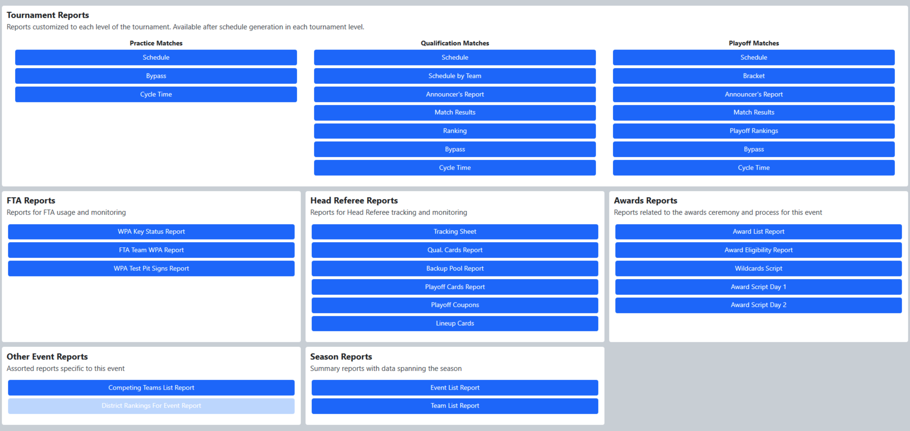
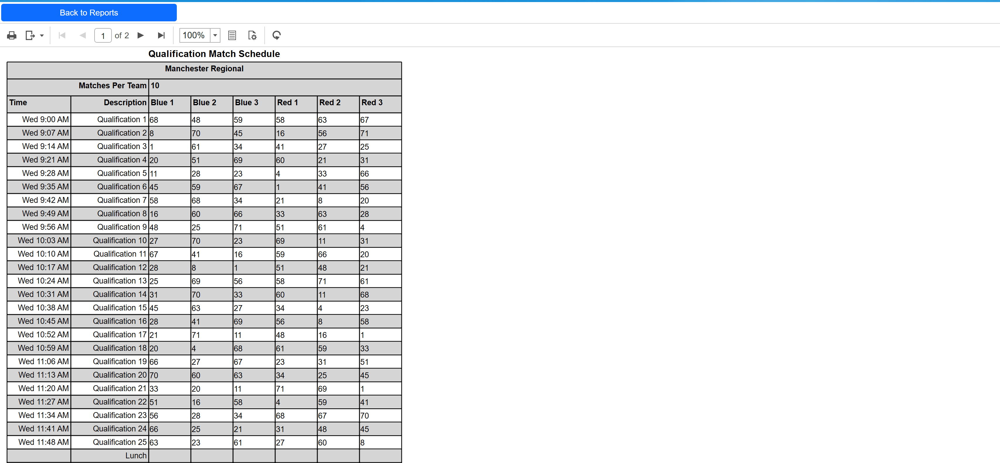

.. _reports-reports:

Reports
===========

Retrieve event information through formatted reports.

Menu
----

The Reports screen is used to generate printable reports needed throughout the tournament.
Printing options can be selected as well as a file-export options in Microsoft Excel, Word or PDF file formats.

Example Report
--------------

An example report, showing the qualification schedule for a demonstration regional. From here the report could be printed or saved using the buttons on the bar above the event title (in this example).

Available Reports
-----------------

Tournament Reports:

* Practice Tournament

   * *Schedule* : Practice tournament match schedule (updated as teams are added or removed from matches)
   * *Cycle Time* : Shows the actual time between match starts
   * *Bypass* : Shows which teams have been Bypassed during which matches of the practice tournament

* Qualification Tournament

   * *Schedule* : Qualification match schedule
   * *Schedule By Team* : Qualification match schedule, sorted by team (lengthy report, not recommended for printing)
   * *Announcer’s Report* : Detailed report of team details for reference by the announcers (one page per match)
   * *Match Results* : Final scores of all completed matches in the qualification tournament
   * *Ranking* : Current qualifiction ranking of all teams at the event (updates as matches are player or re-played)
   * *Bypass* : Shows which teams have been Bypassed during which matches of the qualification tournament
   * *Cycle Time* : Shows the actual time between match starts

* Playoff Matches

   * *Schedule* : Playoff match schedule
   * *Bracket* : Tournament bracket
   * *Announcer’s Report* : Detailed report of team details for reference by the announcers (one page per alliance)
   * *Match Results* : Final scores of all completed matches in the playoff tournament
   * *Playoff Rankings Report* : Shows the playoff alliances in rank order within the current playoff level and with their ranking detail
   * *Bypass* : Shows which teams have been Bypassed during which matches of the playoff tournament
   * *Cycle Time* : Shows the actual time between match starts

FTA Reports:

* *WPA Key Status Report* : Shows if teams have linked or played in matches successfully
* *FTA Team WPA Report* : Same as *WPA Key Status Report* , but with WPA keys shown. Requires FTA password to run and should not be printed.
* *WPA Test Pit Signs Report* : Generates one page per team that has not yet connected to the field (to place in the team’s pit or distribute as reminder to come do a connection test)

Head Referee Reports:

* *Tracking Sheet:* Used by Head Referees for tracking information throughout the event. Head Referee may request a copy from the Scorekeeper.
* *Qual. Cards* : Match schedule showing teams with assigned cards during the qualification tournament
* *Backup Robots* : For tracking teams as they accept or decline their position as a backup robot in the playoff tournament
* *Playoff Cards* : Match schedule showing alliances with assigned cards during playoff matches
* *Playoff Coupons* : Backup robot coupons for the playoffs tournment

Awards Reports:

* *Awards List* : Lists awards to be given out at the event. The winners are included if they have been assigned.
* *Awards Eligibility Report* : Lists all teams attending the event and their eligibility for certain awards (such as the Rookie All Star Award).
* *Wildcards Script* : Script for the Announcer to read should any Wildcards be generated at the event
* *Award Script Day 1* : Script for the Announcer to read for awards expected to be presented on the first day of the event
* *Award Script Day 2* : Script for the Announcer to read for awards expected to be presented on the second day of the event

Other Event Reports:

* *Competing Teams List Report* : Same as the season team list, but filtered to only the teams competing at the currently selected event
* *District Rankings for Event Report* : District rankings of eligible teams playing at the currently selected event. Not representative of overall district ranking, only position at the selected event.
* *Lineup Cards* : Lineup submission sheets for use during the playoff tournament

Season Reports:

* *Event List* : A complete list of all FRC events in the current season (including those manually added via FMS)
* *Team List* : A complete list of all registered FRC Teams for the given season
