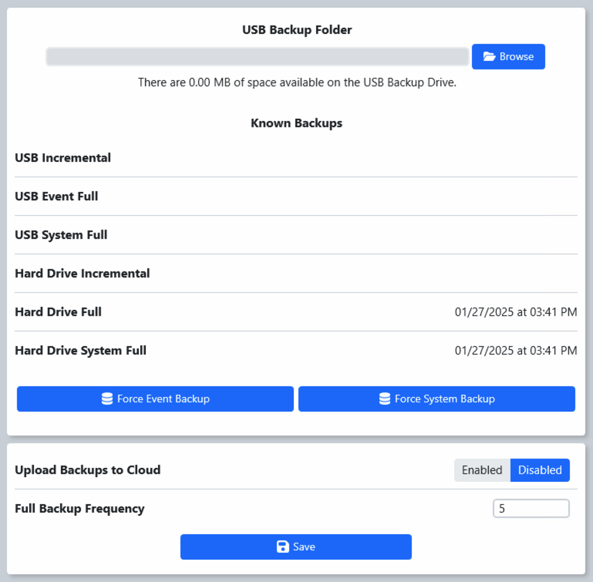

.. _settings-backup:

Backup Config
======================

The Backup Config tab provides facilities to set a data backup location and manually force backups to occur. Backups should be set to an off-system USB storage location using the “Browse” button (red arrow) to select the location. The currently selected location will be shown in the text box to the left of the Browse button.

The backup is used when uploading event archives to FIRST, so it's important to check the backup location in the event of an upload failure (it may be a full location or unavailable). It's also important to keep an eye on the indicator at the bottom of FMS that indicates the backup status; a gray or red status indicator shows that there's a problem with the backup and should be corrected immediately, a gray status indicator shows the backup is working.

The “Force Event Backup” button (blue arrow) is used to manually force a backup for Event-Specific data (such as Match Results, Match Logs, and Tournament Progress). The “Force System Backup” button (green arrow) is used to manually force a backup for System-Specific data (such as Event Lists, Team Data, and system configuration data).

As backups are performed, the times of the latest of each type are shown next to their names.

