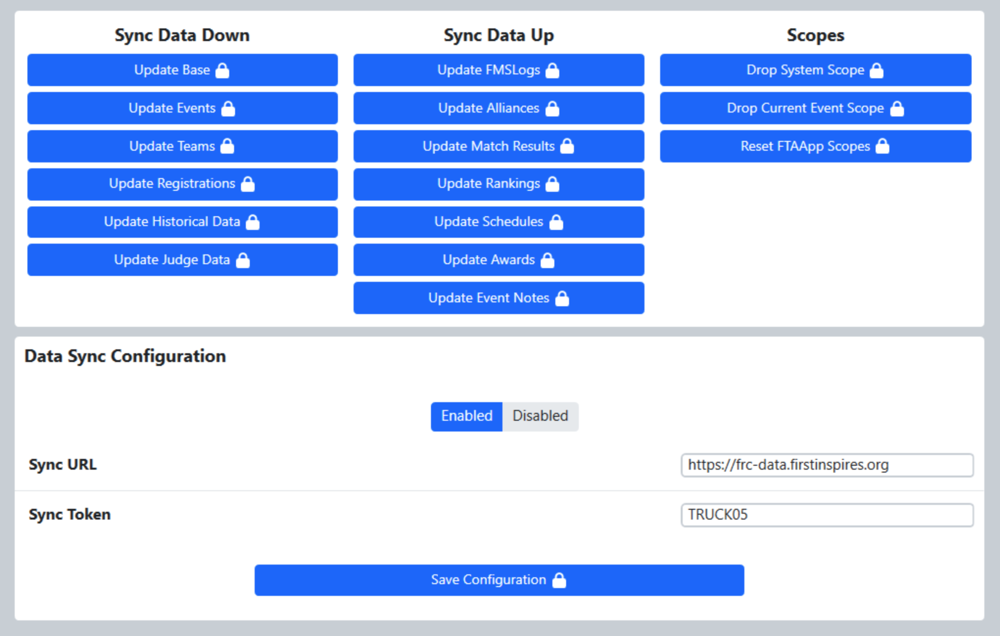

.. _settings-data-sync:

Data Sync
===========

Sync
----

The Data Sync tab is used to monitor and control syncing tournament data to the *FIRST* servers; the functions and settings in this tab are protected using the Settings Lock. It is important to ensure that for off-season events not authorized to sync data to *FIRST* the Sync Setting is DISABLED. If this setting is ENABLED, CPU and network resources are consumed attempting to upload tournament data to *FIRST* servers and may cause delays or errors while running the event.

Beyond the toggle button, status information is displayed for use by FRC Engineering when performing advanced sync related tasks- it's not useful to (or available to) the end user.

