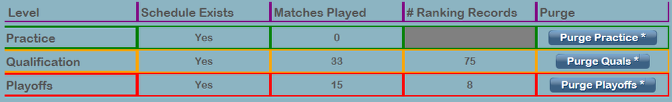
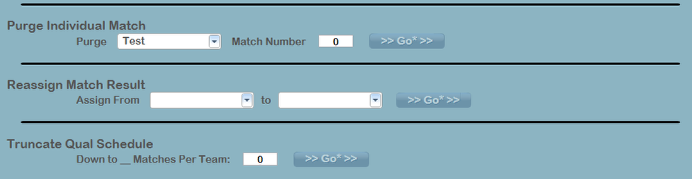

Data
====

Experimental data manipulation options, which should only be executed under the supervision of FRC Engineering.

Event Level
-----------

[ *Red* ] Purge an entire event, all match and alliance data

[ *White* ] Purge just the alliances from an event

[ *Blue* ] Undo any participants added manually, and return the registration list to its state as downloaded from HQ

[ *Green* ] Undo all award assignments, return the awards to their default (unassigned) state

Tournament Level
----------------

[ *Level Column* ] The level being referenced by that data row

[ *Schedule Exists Column* ] Yes/No of whether the schedule has been generated (schedule plus alliance pairings)

[ *Matches Played Column* ] Count of the number of matches played in that level

[ *# Ranking Records Column* ] The number of Qualification ranking records that exist, or, for Playoffs, the number of alliance ranking records that exist

[ *Purge Column* ] Purge the given level, such that all matches and logs are deleted. This cannot be undone.

Detail Level
------------

[ *Purge Individual Match* ] By selecting a tournament phase and entering a match number, dump only one specific match from a level (all plays lost)

[ *Reassign Match Result* ] By selecting a test match and traditional match, the results can be overwritten from the test match to the traditional match. The original results of the traditional match will be lost, and replacement is only done on the most recent play.

[ *Truncate Qual Schedule* ] By entering a value here, the qualification schedule can be shortened, while maintaining equality for all teams (this is only for emergency use, such as acts of god or the direction of FIRST HQ). It requires the password of a support engineer.

