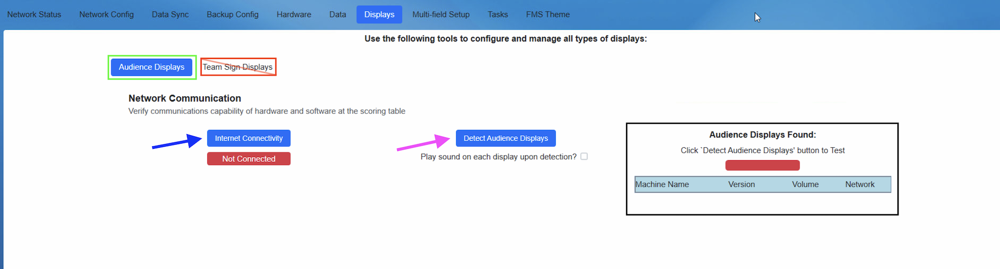
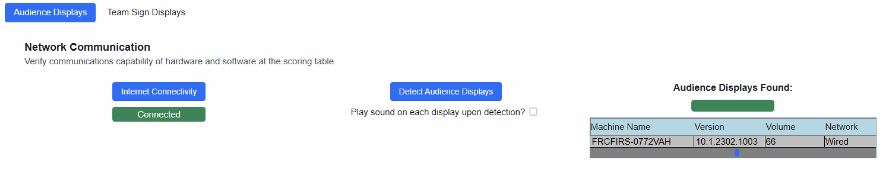

.. _settings-displays:

Displays
======================

The Displays tab contains Audience Displays (green box) and Team Sign Displays (red box) sub-tabs.

Audience Displays Sub-Tab
--------------------------

[*Blue Arrow* - Internet Connectivity] Clicking the Internet Connectivity button initiates a basic check for internet connectivity. A successful test will change the indicator to green.

[*Pink Arrow* - Detect Audience Displays] Clicking the Detect Audience Displays button initiates a check for Audience Displays on the field network. Additionally, selecting the checkbox below will cause each active instance of Audience Display to play a sound. Please note that the Audience Display software must be running on the target device in order to be detected.

[*Black Box* - Audience Displays Found] A successful check for Audience Displays will turn the indicator green. Additionally, each instance of Audience Display detected will be populated in the list with its respective information and configuration.

A successful check for internet connectivity as well as Audience Display presence should yeild similar results to those pictured below.

Team Sign Displays Sub-Tab
---------------------------

This sub-tab is used for the management of future generation team sign displays and is currently not to be used or modified.