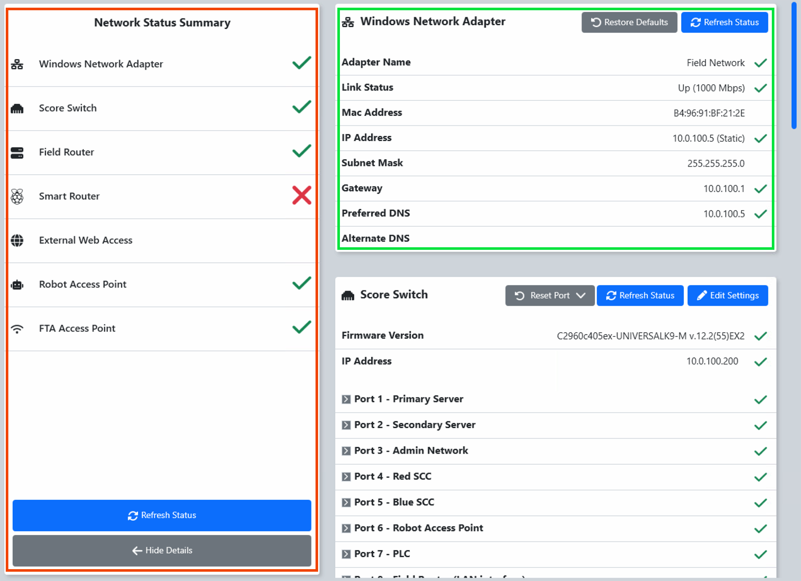
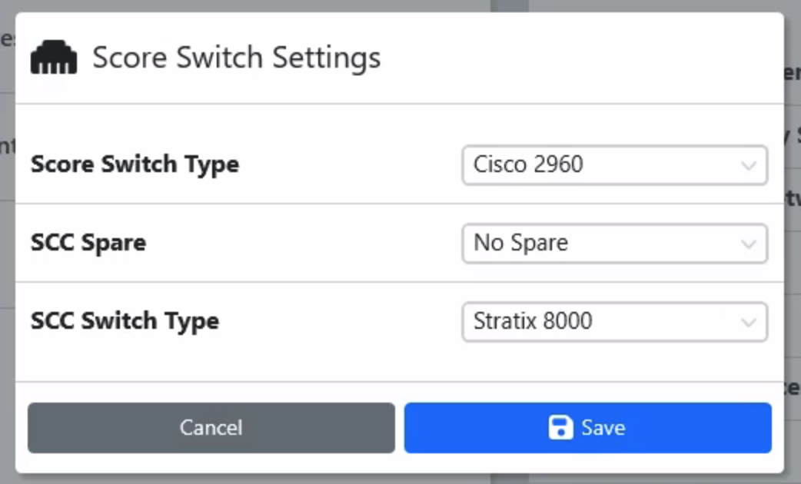
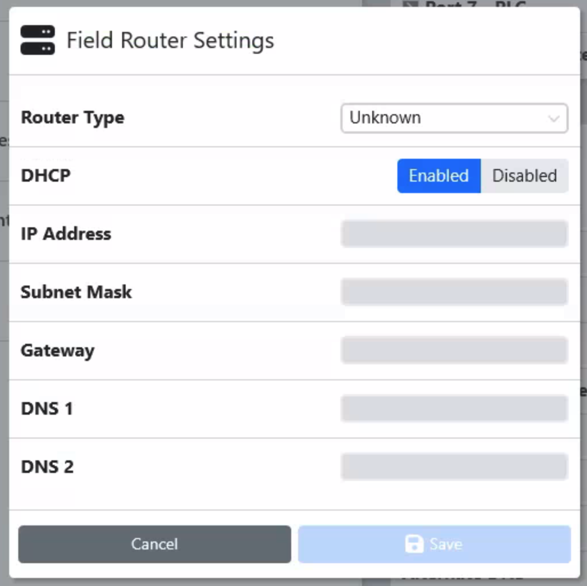
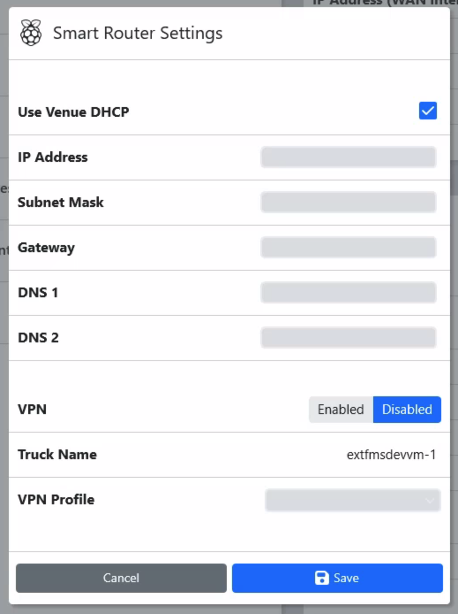
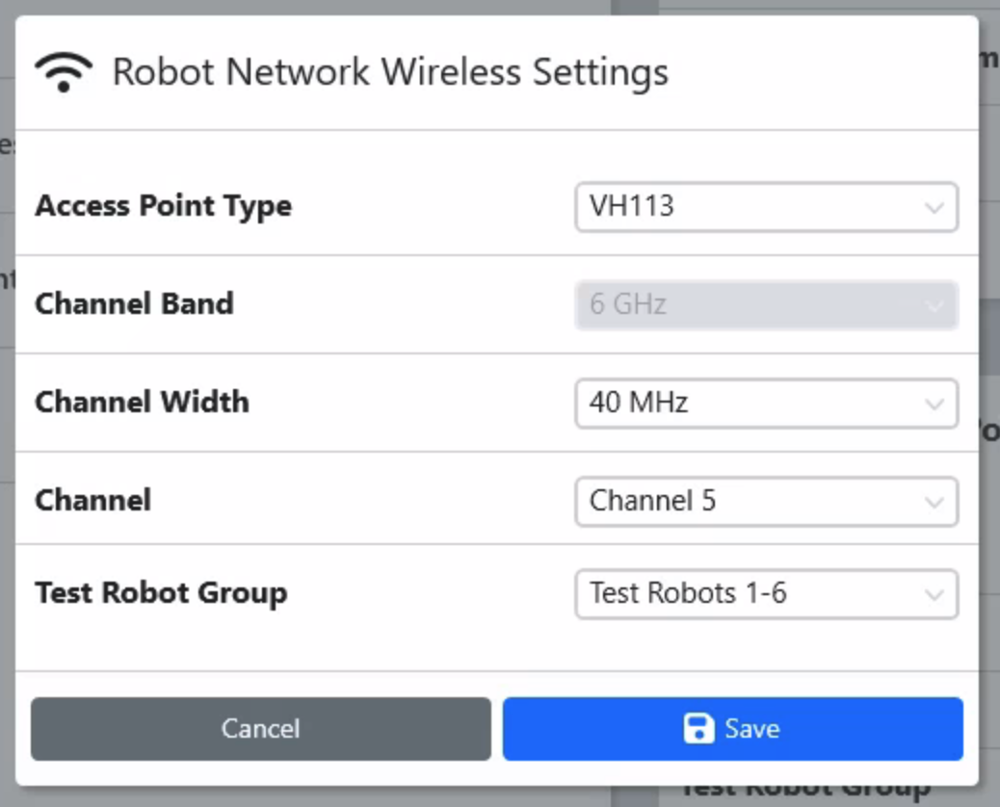
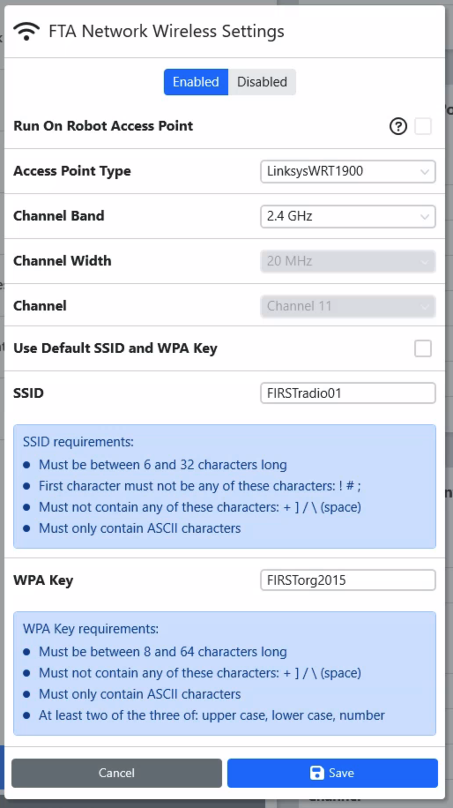

.. _settings-fms-network:

FMS Network
======================

The FMS Network tab on the Settings page contains all of the network status information that is 
queried from the FMS hardware and software. It has scrolling sections on the right for the components that 
are queried: Windows Network Adapter, Score Switch, Field Router, Smart Router, External Web Access, 
Robot Access Point and FTA Access Point. 

[ *Red* - Overview] The components and their general status, the details of which can be viewed in the right side section

[ *Green* - Detail] Detailed information for each tracked component

FMS Network Sections
#################################

[ *Windows Network Adapter* ]
FMS can only operate correctly, and communicate with Robots, when it's Windows adapter is properly configured. 
This check will verify the configuration and the "Restore Defaults" option can be used to correct any discrepancies.

[ *Score Switch* ]
Checks the status of each port on the managed switch inside the #33 road case. The "Edit Settings" option 
is used to specify the hardware types in use on the field. In most cases, the only value that would need adjustment 
is the "SCC Spare" if a replacement cabinet is being used on the red or blue field end.

The "Score Switch" and "SCC Switch" Types need not be adjusted without the direction of FIRST Engineering 
as they are configured prior to the field being shipped. 

[ *Field Router* ]
Checks the status and settings of the router inside the #33 road case. The "Edit Settings" option 
is used to specify the Router Type and DHCP settings for the incoming internet network. The "Router Type" 
need not be adjusted without the direction of FIRST Engineering as they are configured prior to the 
field being shipped.

.. warning::
    In almost every case the Field Router need not be adjusted, as the Smart Router would be updated to the venue-specific settings instead.

[ *Smart Router* ]
Checks the status of the Smart Router- the device that sits between the venue internet and the field network. This device is responsible for detecting 
the venue IP and providing an address in a non-colliding scheme to the Field Router. The "Edit Settings" option can be used to specify a venue 
configuration if a static IP is required. Smart Router should only be edited under the supervision of the FTA or FIRST Engineering.

[ *External Web Access* ]
FMS uses several web based programs and services to support event operation. This check attempts to communicate with the most common 
services and displays whether or not the attempt is successful. 

[ *Robot Access Point* ]
Checks the status of the 6GHz Vivid Hosting radio used for Robot communication from Driver Stations. Clicking the "Edit Settings" button allows 
adjustment of the Access Point hardware in use as well as channel information. Under normal operation, FRC fields use the VH113 radio and 
Test Robots 1-6. The test group can be used to avoid overlaps of radio test groups when there are multiple FRC access points at the event. 
Do not change the settings on the Access Point without FTA and/or FRC Engineering support.

[ *FTA Access Point* ]
Checks the status of the 2.4/5GHz radio used for FTA/Field Staff operations on the field network. Clicking the "Edit Settings" button allows 
adjustment of the Access Point hardware in use as well as channel information. Under normal operation, FRC fields use the Linksys 1900 radio on 2.4GHz.
The SSID and WPA Key is configurable by the FTA without a password, but once set the WPA Key value will not persist once the software navigates away from the Settings page.
If the WPA Key is forgotten, a new one must be set by the FTA. Do not change the settings on the Access Point without FTA and/or FRC Engineering support.

