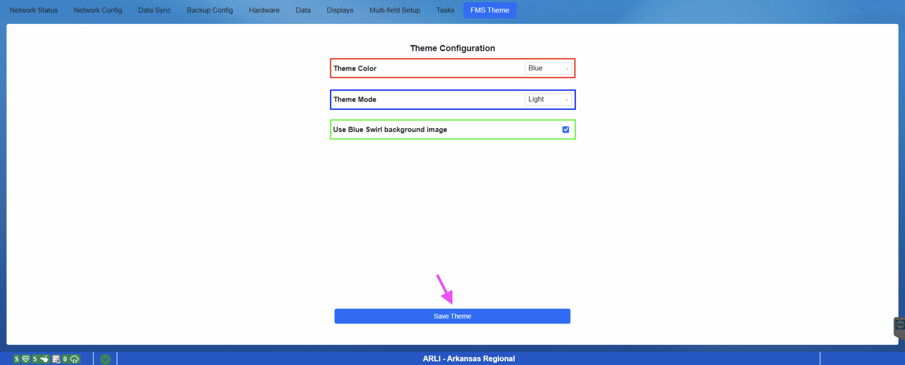

.. _settings-fms-theme:

FMS Theme
======================

The FMS Theme tab allows for the modification of the appearance of the FMS software.

[*Red Box* - Theme Color] Select from several theme color options.

[*Blue Box* - Theme Mode] Select from Light or Dark mode.

[*Green Box* - Optionally choose to use the blue swirl background image.]

Once configured, click on Save Theme (purple arrow) to save the selections. A restart of FMS is required for theme settings to take effect.

.. note::
    For those who wish to adjust the FMS Theme, current guidance is to make your selections during event setup and maintain those selections througout the event, avoiding unnecessary FMS restarts.

