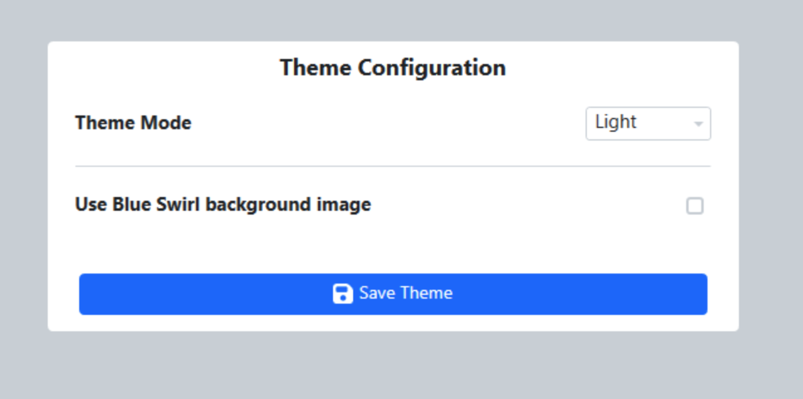

.. _settings-fms-theme:

FMS Theme
======================

|
| The FMS Theme tab allows for the modification of the appearance of the FMS software.

[ Theme Mode ] Select from Light or Dark mode.

[ Swirl ] - Choose to use a solid color or the blue swirl background image.

Once configured, click on Save Theme to save the selections. A restart of FMS is required for theme settings to take effect.

.. note::
    For those who wish to adjust the FMS Theme, please make your theme selections during event setup and do not change this setting while playing matches.
