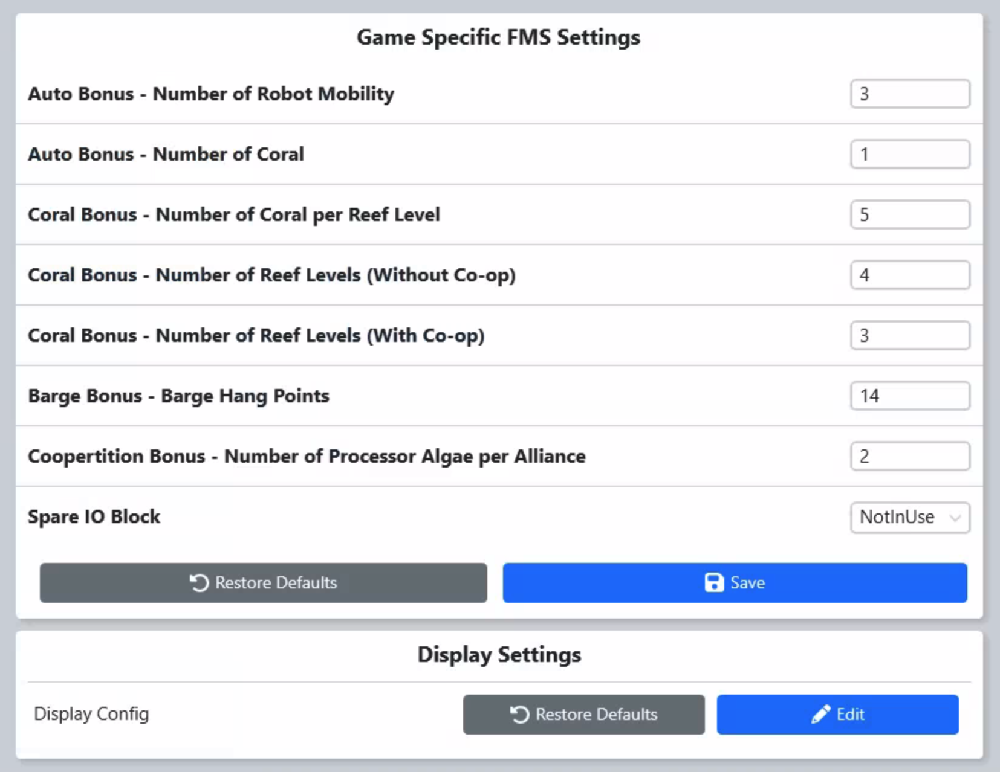

.. _settings-game-specific:

Game Specific
=============

|
| The Game Specific tab is used to change thresholds and settings for various game-specific scoring actions. These should only be changed under the direction 
    of *FIRST* Engineering (and require an HQ password) except at Off-Season events. Only one spare component of each type is allowed to be used on a field; the spare
    component (such as IO Block) is generally marked with White or Black gaffer's tape on the handle/front, whereas the normal component is generally marked with a Red or Blue (alliance-colored)
    piece of gaffer's tape. 

If a spare LED Display is in used in the Alliance Stations, the location can be specified by clicking "Edit" under "Display Settings"
