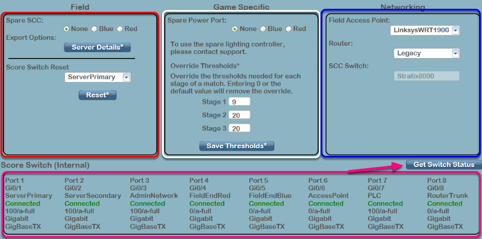
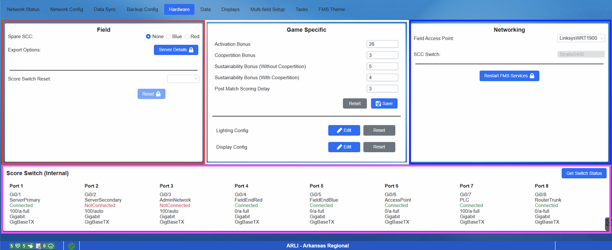

Hardware
========

Hardware
--------

The Hardware tab is used to indicate the use of specific hardware provided for the field. Because configurations are different when using spare hardware, the FMS needs to know the locations and other information of the hardware. Only one spare component of each type is allowed to be used on a field; the spare component is generally marked with White or Black gaffer’s tape on the handle/front, whereas the normal component is generally marked with a Red or Blue (alliance-colored) piece of gaffer’s tape. The layout of the tab is similar to the `Network Config <../../eventmanager/l/607919-network-config>`_ tab.

[ *Red* - Field] Contains configuration options for the Spare SCC (field ends or not in use). The Export Server Details button provides FRC Engineering with a full system configuration output to better help troubleshoot configuration problems.

[ *White - Game Specific* ] Manipulate the configuration of the spare Power Port (Goal) MiniSCC

[ *Blue* - Networking] Contains configuration options for the type of Access Points, Routers and SCC Switches in use (for FRC Engineering use)

* The "SCC Switch" displays the version of SCCs that are in use on the field. While not selectable, you may be asked by FMS Engineering to provide this information during troubleshooting. If this box says "Unknown", you'll be unable to run matches.* Selections for the two drop-down boxes must match the hardware on the field in order for matches to run.

[ *Pink* - Score Switch] Clicking the Get Status button (see arrow) collects information about the internal operating status of the score switch located inside the scoring table road case. Most of this information is for use by troubleshooting and support staff.

