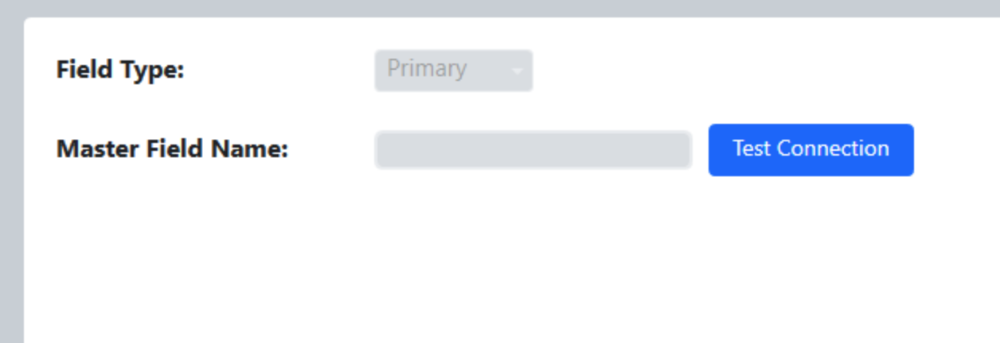

.. _settings-multi-field:

Multi-field Setup
======================

For events that have more than one playing field.

Setup
-----

|
| Multi-field setup is used for configuring FMS for use at events with more than one active playing field. Do not modify anything within this tab without FRC Engineering support.

This mode is not available to events without coordination with *FIRST* . It is used at the *FIRST* Championship.
