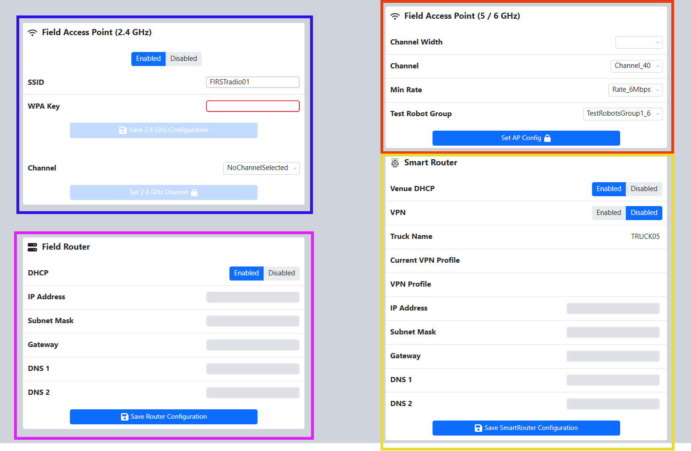

Network Config
==============

Config
------

.. image:: images/network-config-1.png

The Network Config tab on the Settings page contains all of the network settings that may be adjusted for the FMS hardware and software. The Network Config tab is the default tab on the Settings Page. It has four sections: Smart Router, Router, Windows and Access Point.

[ *Red* - Smart Router] Contains functions for setting the Smart Router configuration within the FMS Hardware set. Set Router Configuration can be used to configure the router settings for venue-specific network access configuration. Do not change the settings on the Smart Router without FTA and/or FRC Engineering support.

[ *White -* Router] Provides functions for setting configuration information for the Router inside the #33 case. Set Router can be used to configure the router settings for venue-specific network access configuration. Do not change the settings on the Router without FTA and/or FRC Engineering support.

[ *Green* - Windows Network] Used to reset the Windows Network settings to their default, expected values.

[ *Blue* - Access Point] Contains functions for setting the Access Point configuration within the FMS Hardware set. Set Access Point can be used to configure the radio used on the Field. Do not change the settings on the Router without FTA and/or FRC Engineering support. The SSID and WPA Key is configurable by the FTA without a password, but once set the WPA Key value will not persist once the software navigates away from the Settings page. If the WPA Key is forgotten, a new one must be set by the FTA. Additional options allow support staff to configure the minimum rate for operation of the robot facing side of the radio.

For events with multiple fields, the "Group" option can be changed to avoid overlap in radio test groups across access points.

To change the type of Router or Access Point in use, visit the `Hardware <../../eventmanager/l/607922-hardware>`_ tab. For Status information visit the `Status <../../eventmanager/l/1061805-network-status>`_ tab.

