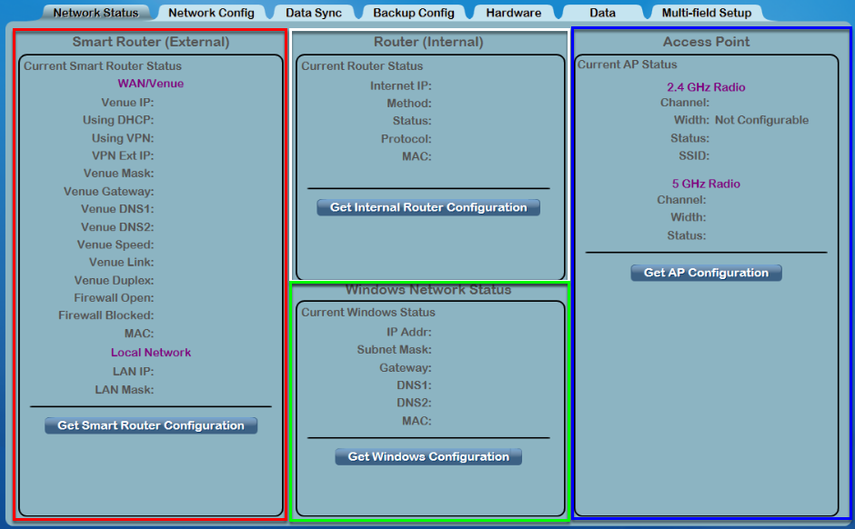
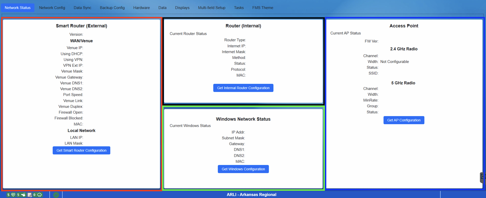

Network Status
==============

Status
------

The Network Status tab on the Settings page contains all of the network status information that is queried from the FMS hardware and software. The Network Status tab is the default tab on the Settings Page. It has three sections: Smart Router, Router, and Access Point. All data on this tab is "Read Only", adjustments are made through " `Network Config <../../eventmanager/l/607919-network-config>`_ "

[ *Red* - Smart Router] Contains functions for getting the Smart Router configuration within the FMS Hardware set. Get Router Configuration will query the router settings from the built-in Smart Router within the FMS “Scorpion” server, and display them.

[ *White* - Router] Contains functions for getting the Router configuration within the FMS Hardware set. Get Router Configuration will query the router settings from the built-in Router within the FMS “Scorpion” server, and display them.

[Green - Windows Settings] Displays the current Windows Network Settings and highlights any fields which do not contain the expected values.

[ *Blue* - Access Point] Provides functions for getting configuration information for the Access Point used by FRC. Get AP Configuration gets the current Access Point configuration and displays it.

To change the type of Router or Access Point in use, visit the `Hardware <../../eventmanager/l/607922-hardware>`_ tab.

