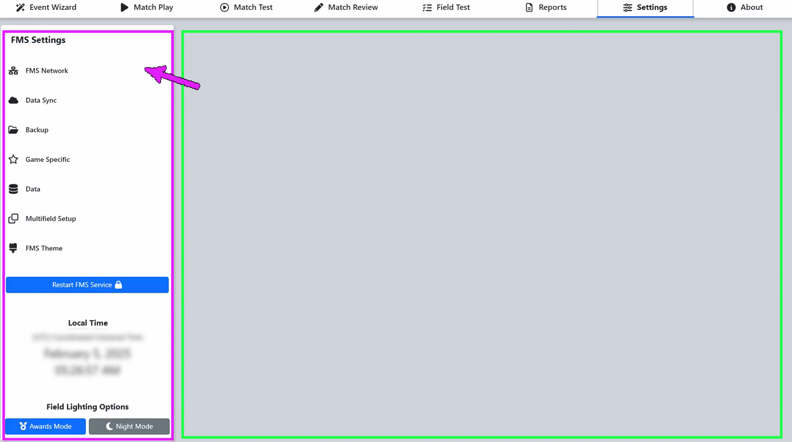

Settings Menu
=============

Menu
----

.. image:: images/settings-menu-1.png

The settings screen contains important global settings for network, hardware, backup, and data configurations within the FMS Software. Some items within the Settings screen may be used by Scorekeepers and FTAs, such as Backup Configuration, some network settings, spare hardware configuration, and others. However, some of the items are protected via a Settings Lock and can only be unlocked by FRC Engineering staff. These items are deemed “Critical” (as in the case of AP channel configuration or changing the Data Sync state) or “Experimental” (as in the case of purging tournament data). Items within the Settings page that are protected by the Settings Lock are followed by an asterisk (*). In the Off-Season version of the software the Settings are permanently unlocked though some features (such as hardware configuration or Data Sync) are disabled because they do not apply.

The top bar of the Settings Page (pink arrow), encompassed with a white background, contains quick-access information and commonly used tools. On the far-left is the current server time information, including the currently active time zone. It is important that the time zone of the server be set correctly for the location the event is being held, especially if the event will have schedules and data available online. In the center are quick-access field lighting settings; Awards Mode will enable all LEDs on the field (to match their alliance color) and display the current year on the Team Signs, whereas Night Mode will turn all LEDs on the Field off.

Below the bar is a series of settings tabs (green arrow). Clicking these tabs will change which data is available on the lower portion of the screen (green box). Information about each tab can be found in its associated documentation step.

