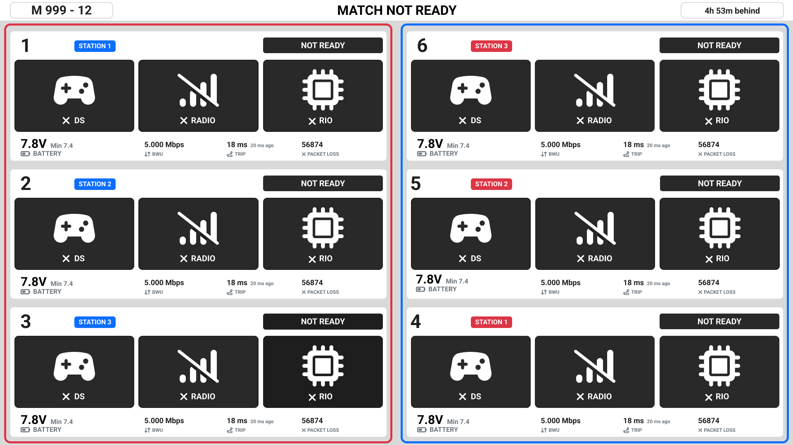
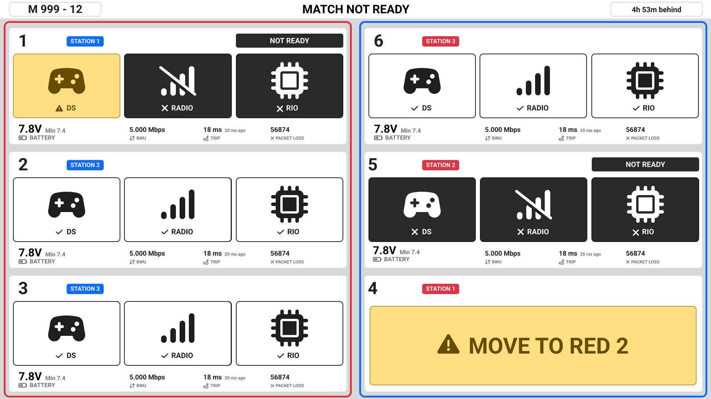
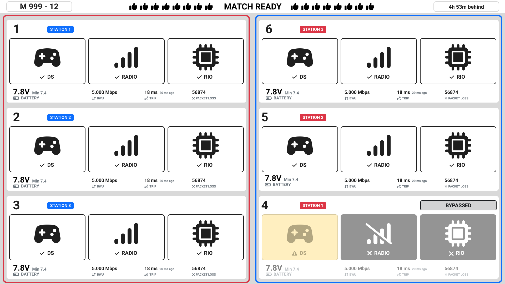
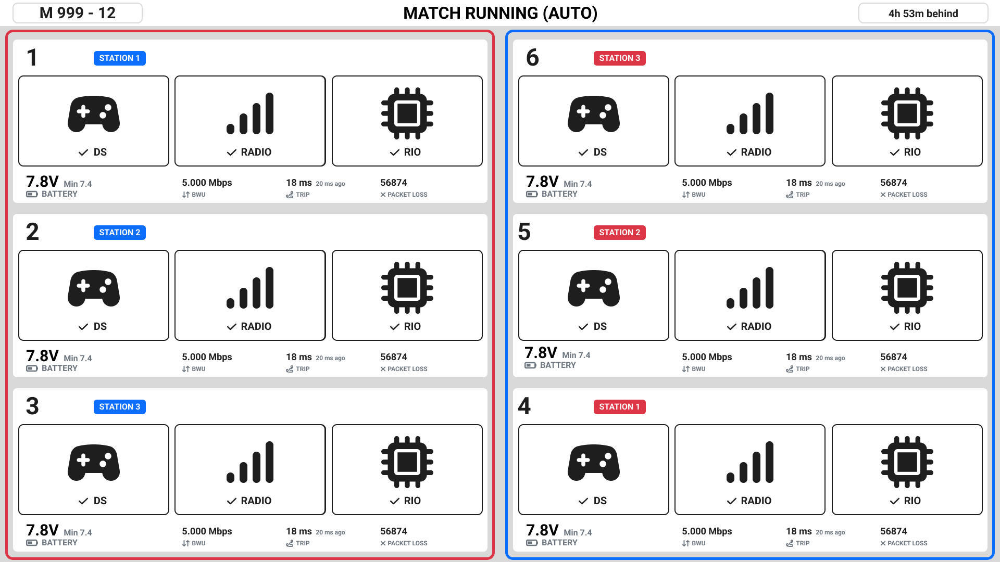
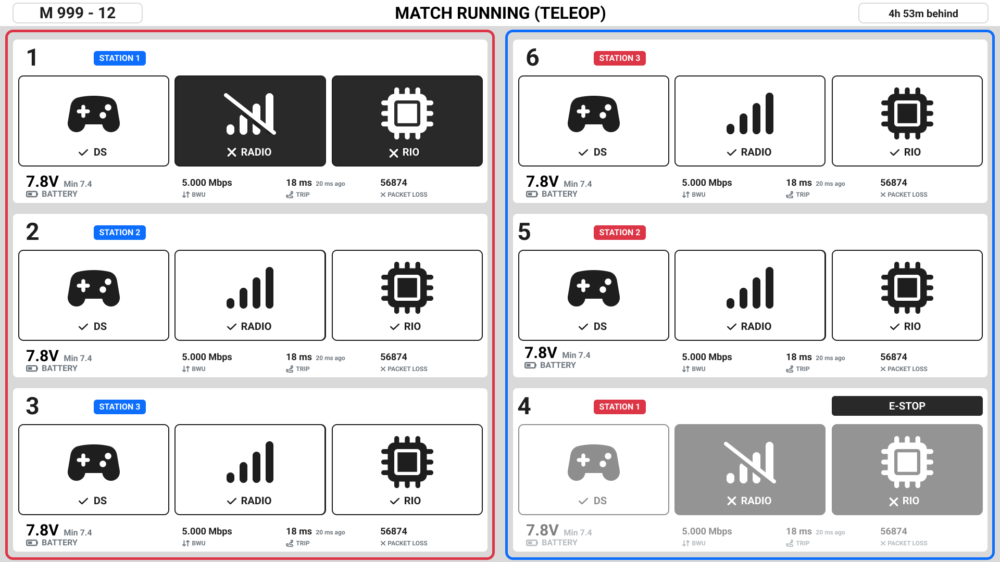
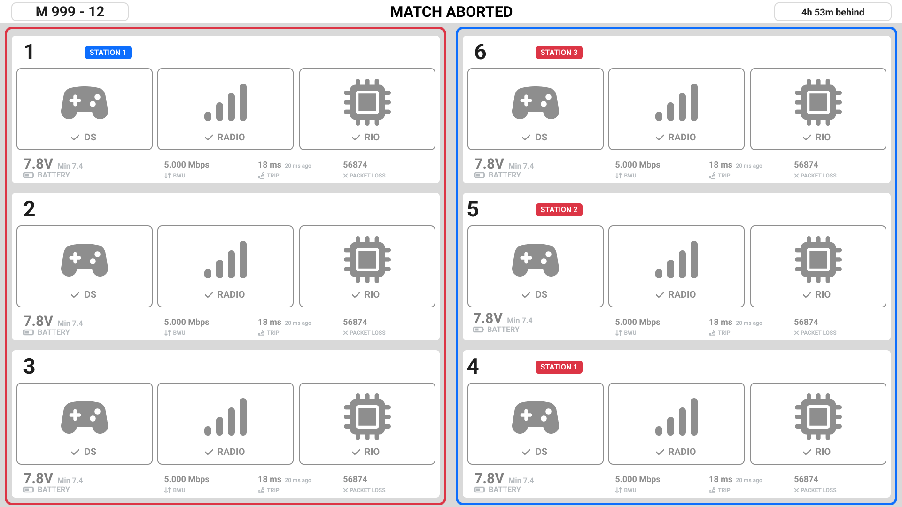
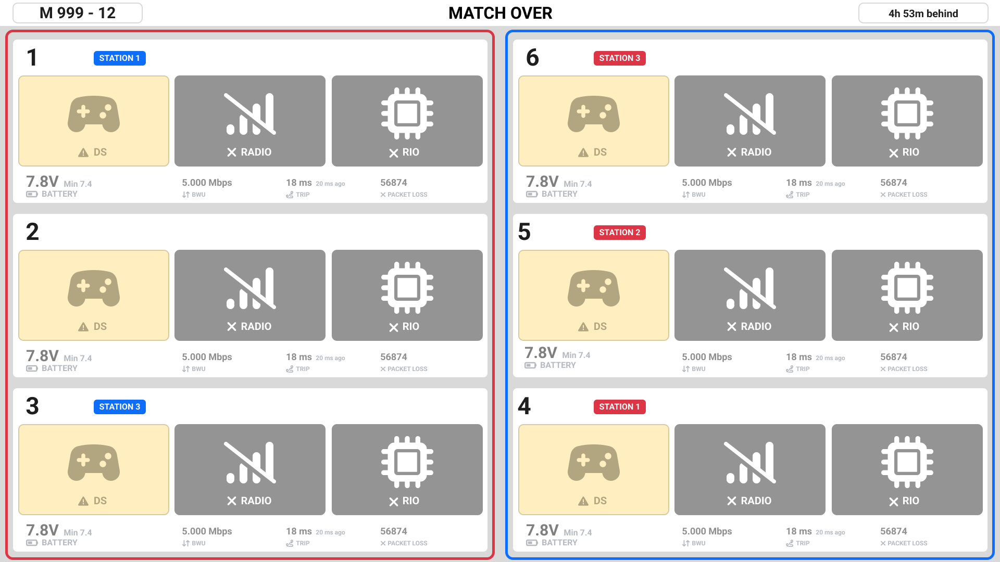
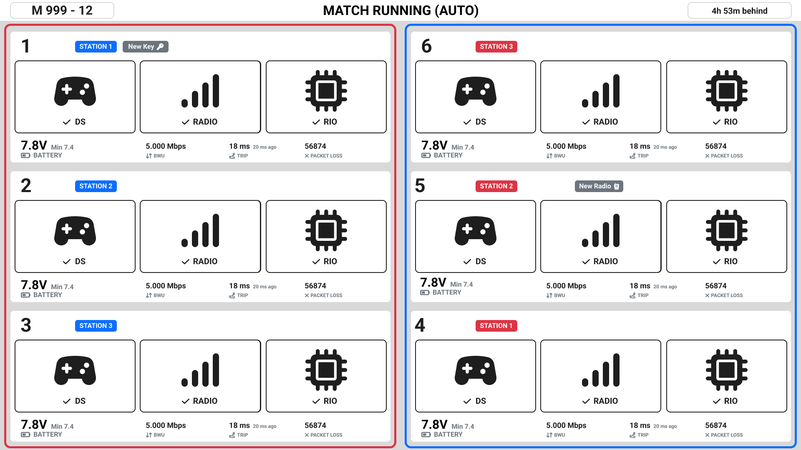
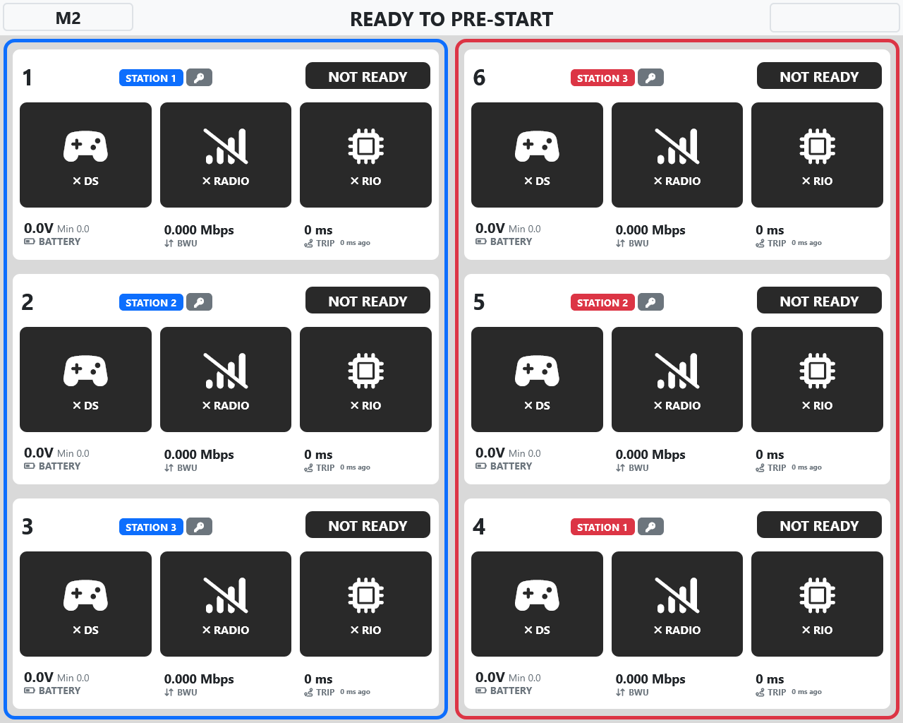
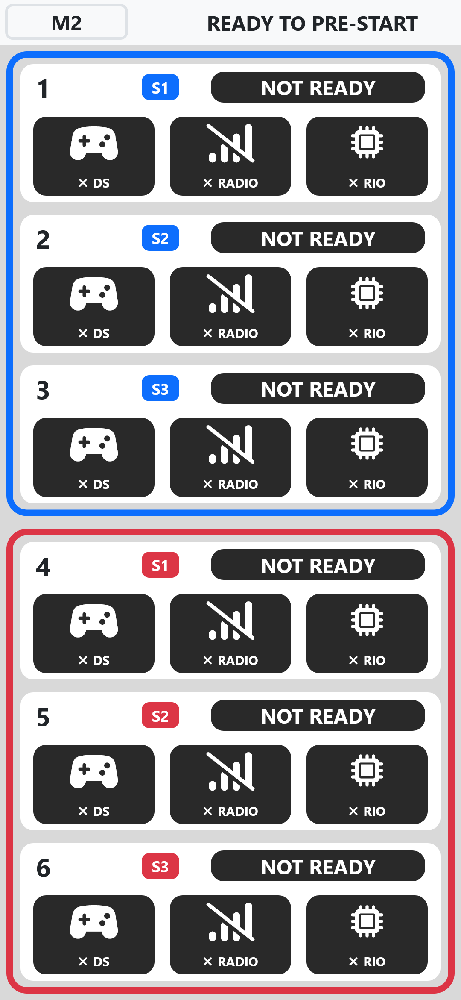

.. _field-monitor-v3-live-simple:

Field Monitor
=============

The Field Monitor provides a live view of robot and field status. To view the Field Monitor, access the web interface at 10.0.100.5 and select Field Monitor from the navigation bar.  Use ctrl-b to swap the position of the red and blue field ends.

The Field Monitor shows match state and robot/driver station connectivity. The top row of the field monitor shows the match number and the match status.

Driver station pane
-------------------

Each of the six driver stations has a pane that shows status for that station.  In each pane, the first number indicates the station, 
and the second number indicates the team assigned to that station. In the example above, team #4 is assigned to the Red 3 station.

Four symbols show the connectivity state of the station.

======  ===========
Label   Description
======  ===========
DS      Driver Station connectivity.
Radio   Robot radio connectivity.
RIO     indicates whether the Driver Station is communicating with the roboRIO.
Robot   indicates the current state of the robot.
======  ===========

:ref:`Status Indicators <field-monitor-v3-status-indicators>` provides details on the meaning of the connectivity state symbols.

When a robot is fully connected, the statistics section populates with useful metrics about the robot and its connectivity to the field.

==============  ===========
Label           Description
==============  ===========
Trip Time       The round trip time taken by the control/status packets between the driver station and the roboRIO, in milliseconds.
BWU             Network bandwidth consumption between the driver station and robot, in megabits per second.
Missed Packets  Count of control packets that were not acknowledged by the roboRIO.
Battery         Current voltage and lowest voltage reported by the roboRIO.
==============  ===========

Prior to Prestart
-----------------

No valid robot data is shown prior to prestart. It is normal to see TEAM MISMATCH prior to prestart, as the comparison is being 
made to the teams from the previous match.

Pre-Start Complete
------------------

Once prestart is completed, valid data is shown on the monitor.

Team 1 has a computer connected in to the driver station, but the Driver Station software is not running.

Team 5 is connected to Team 4's Driver Station, indicated by the yellow bar "MOVE TO STATION 2". The team's driver station and the 
display on the back of the team sign will also indicate that they should move to a different station.

The team in Station 4 has a team number that is not in the match.  TEAM MISMATCH can also appear if the match has not been prestarted.

Match Ready
-----------

The match is ready to start. Team 4 is Bypassed (will not run in this match).

.. note::
  When a robot is bypassed, all of the status indicators will be greyed out (50% transparency) but will still update in real time if the robot or DS connect to the field.

Match Running
-------------

All robots are running in autonomous mode.

Match Running (E-Stop and Radio disconnect)
-------------------------------------------

Robots are running in teleop mode. Team 4's robot has been e-stopped, either by the e-stop button in their station or by field staff. Team 1's radio is not connected to the field access point.

.. note::
  When a robot is E-Stopped, all of the status indicators will be greyed out (50% transparency) but will still update in real time if the robot or DS connect to the field.

Match Aborted
-------------

Indicates that a running match was stopped by field personnel.  It will return to "Ready for Prestart" promptly. All stations become greyed out after a match ends or is aborted until the next match is pre-started.

Match Over
----------

The match ran to completion successfully. Robot radios are no longer connected.  Driver station laptops are connected but there is 
no longer communication with the driver station softare. All stations become greyed out after a match ends or is aborted until the next match is pre-started.

Special indicators
------------------

In blue station 1, the grey badge that says "New Key" indicates that the team has not yet participated in a match.

In red station 2, the grey badge that says "New Radio" indicates that the robot radio's MAC address is new for this team. This icon does not show for a team's first match. 

The robot radio must be connected for these indicators to appear.

Responsive layout
-----------------

On smaller resolution screens, the page will hide some information in favor of making the 4 main status indicators more easily visible.

| 
| On phone screens, the stations will be vertically stacked.