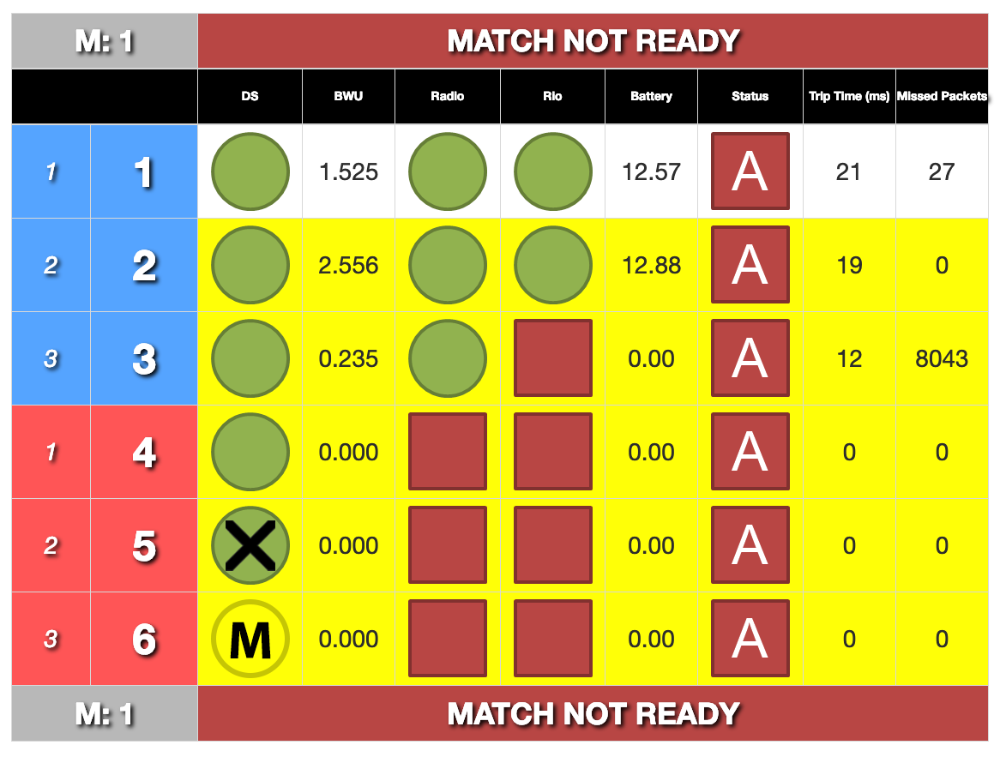

.. _field-monitor-connectivity-guide:

Connectivity Guide
======================

Introduction
------------

When using the Field Monitor to diagnose connectivity issues, always work from left to right. All connection statuses are reported to the FMS by the Driver Station (DS). This means that regardless of true connection status, a Radio won't "go green" until the DS is fully connected. Additionally, a roboRIO won't "go green" unless the Radio is connected.

In this example, all six teams have a varying connectivity state.

* Team 1: Fully connected and match-ready.
* Team 2: All green indicators, but yellow bar is still present. This state is generally the result of a robot code issue, and will prevent the field from "going green" until resolved.
* Team 3: No roboRIO connection.
* Team 4: No Radio connection. A green Radio connection is required in order to have a green roboRIO connection.
* Team 5: An ethernet cable is plugged in, but the DS isn't properly communicating with the FMS.
* Team 6: Wrong station. Yellow "M" signifies that the team must "Move" to the correct station. Yellow "W" signifies that the team has come up for the "Wrong Match".

Reminder: When troubleshooting connectivity, always start with the DS and work your way from left to right on the Field Monitor.

Driver Station Troubleshooting
------------------------------

DS Ethernet
^^^^^^^^^^^

If the Field Monitor shows a DS ethernet connection, move on to **DS Software**.

#. Verify DS ethernet cable is securely plugged into the DS computer, making sure to check for worn out ethernet ports.
#. Verify the DS computer is turned on and logged in.
#. Verify the DS computer's ethernet adapter is enabled and functioning. (Quickly access network adapters by typing "ncpa.cpl" into the start menu and pressing the return key). 
#. If the adapter is found in step 3:

   * Disable/Re-enable the adapter.
   * Restart the DS Computer.
   * Verify the cable by connecting to a different device.
   * Use a USB to ethernet adapter.
   * Offer a loaner DS.
  
#. If no adapter is found in step 3:

   * Restart the DS computer.
   * Use a USB to ethernet adapter.
   * Offer a loaner DS.

DS Software
^^^^^^^^^^^

If the Field Monitor shows a fully green DS connection, move on to **Robot Troubleshooting**.

#. Confirm the DS software is running on the DS computer.
#. Confirm the team is in the correct station, and in practice matches, verify the correct number was entered prior to Prestart.
#. Disable all additional network adapters. (Quickly access network adapters by typing "ncpa.cpl" into the start menu and pressing the return key)
#. Verify the DS computer's ethernet adapter is enabled and functioning. 
#. If the adapter is found in step 4:

   * Verify the adapter is set to 'Obtain an IP address automatically' (DHCP).
   * Disable/Re-enable the adapter.
   * Restart the DS Computer.
   * Verify the cable by connecting to a different device.
   * Use a USB to ethernet adapter.
   * Offer a loaner DS.

#. If no adapter is found in step 4:

   * Restart the DS computer.
   * Use a USB to ethernet adapter.
   * Offer a loaner DS.

#. Restart the DS Software
#. Disable all three Windows Defender Firewall profiles (Domain, Public, Private) as well as any third-party firewall applications if present.

   * If the firewall cannot be disabled (often due to lack of admin access) consider using the loaner DS.
   * If the firewall can't be disabled but allows for specified ports to be opened, create port exceptions for:

   .. list-table:: 
    :widths: 40 60
    :header-rows: 1

    * - Ports
      - Service
    * - UDP/TCP 1180-1190
      - Camera Data
    * - TCP 1735
      - SmartDashboard
    * - UDP 1130
      - DS-to-Robot Control Data
    * - UDP 1140
      - Robot-to-DS Status Data
    * - HTTP 80
      - Camera/Web Interface
    * - HTTP 443
      - Camera/Web Interface Secure
    * - UDP/TCP 554
      - RTSP for h.264 Camera Streaming
    * - UDP/TCP 5800-5810
      - Limelight Camera or Team Use

#. Release/Renew the IP address.
#. If the DS still has not connected, look for other possible solutions. For example, check ethernet cable, check for odd DS configurations such as MacOS running a Windows virtual machine. flaky computer, weak battery, very high CPU usage, etc.
#. If the team still has not connected:
   
   * Get an FTA involved.
   * Offer a loaner DS.
   * Follow up by working with the team to troubleshoot when time allows.

Robot Troubleshooting
---------------------

Note: When troubleshooting a robot, a team-member should perform any actions which require contacting the robot. You should only contact a robot if the team directly asks for your assistance. 

Robot Radio
^^^^^^^^^^^

If the Field Monitor shows a green Radio connection, move on to **roboRIO**.

#. Verify the robot is powered on. Locate the radio and check that it is receiving power. (~60 second boot time)
#. Verify the radio is in bridge mode and programmed for the event.

   * Green LED indicates the radio is in Bridge Mode and Linked. If the Field Monitor still does not show a Radio connected, verify firewalls are disabled on the DS.
   * Amber/Red LEDs indicate the radio is in AP Mode and has yet to be programmed. At the discretion of the FTA, the radio may be (re)programmed on the field.

#. If a radio is powered on and booted in bridge mode but does not link to the field:

   * Verify the radio has been programmed for the current event in progess. (Radios must be reprogrammed for each new event)
   * Check with the team to ensure they have no backup radios powered on in the venue.

roboRIO
^^^^^^^

#. Verify the roboRIO is receiving power.
#. Check for activity on the amber ethernet traffic light on the roboRIO. If there is no activity on the link light (not flashing, or flashing very slow):

   * Confirm the ethernet cable is fully seated on both ends.
   * Confirm the green ethernet link light on the roboRIO is illuminated. If it is not, the cable should be replaced.
   * Have the team move the cable to a different port on the radio, or directly into the radio if the roboRIO was connected through a switch.
   * Reset the roboRIO. (Circular blue button on the front panel)
   * Power Cycle the robot.

#. For roboRIO 2.0 models, verify the microSD card is present and fully seated.
#. Confirm that the yellow roboRIO status light is not on or blinking. If it is, the roboRIO must be re-imaged.
#. Verify all firewalls are disabled on the DS.
#. Reset the roboRIO. (Circular blue button on the front panel)
#. Power Cycle the robot.
#. Confirm the roboRIO is running the correct image.
#. If the Field Monitor shows a green connection with the roboRIO but the team's row has a yellow background:

   * Ask the team if code was changed between matches. (If yes, the team likely did not build/deploy correctly)
   * For roboRIO 2.0 models, verify the microSD card is present and fully seated.
   * Check the DS diagnostics tab for messages from the robot.
   * Reset the roboRIO. (Circular blue button on the front panel)
   * Power Cycle the robot.

