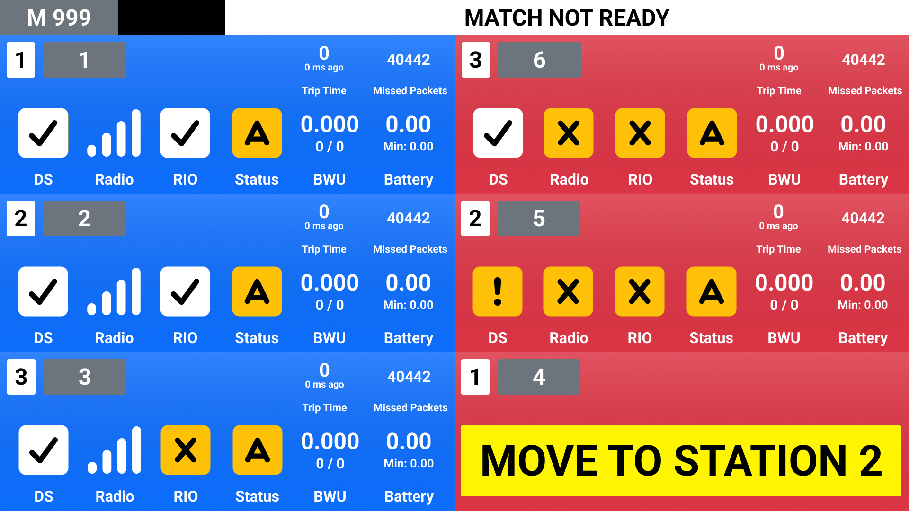
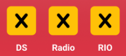
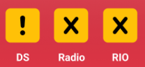
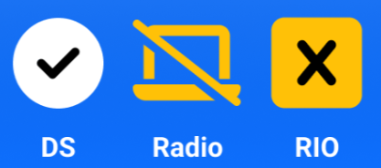
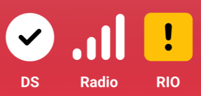

.. _field-monitor-connectivity-guide:

Connectivity Guide
==================

Introduction
------------

When using the Field Monitor to diagnose connectivity issues, always work from driver station, to radio, to roboRIO.  
On the field monitor, this means work from left to right. All connection statuses are reported
to the FMS by the Driver Station (DS). This means that regardless of true connection status, a robot radio won't fully connect 
until the driver station is fully connected. Similarly, the roboRIO won't fully connect until the robot radio is fully connected.

:ref:`Status Indicators <field-monitor-status-indicators>` describes all of the potential status indicators in detail.

In this example, each team has a different connectivity state.

* Team 1: Fully connected and match-ready.
* Team 2: Same as 1.
* Team 3: No roboRIO connection.
* Team 4: The team's driver station laptop is connected to the wrong driver station.
* Team 5: An ethernet cable is plugged in, but the driver station software is not running or is unable to communicate with the FMS.
* Team 6: No Radio connection. A Radio connection is required in order to have a roboRIO connection.

.. note::
   When troubleshooting connectivity, always start with the driver station and work your way from left to right on the Field Monitor.

Driver Station Troubleshooting
------------------------------

You are verifying that the driver station has Ethernet connectivity and properly configured software.

Driver Station Ethernet
^^^^^^^^^^^^^^^^^^^^^^^

This status indicates no ethernet connectivity.

#. Verify ethernet cable is securely plugged into the laptop, making sure to check for worn out ethernet ports.
#. Verify the laptop is turned on and logged in.
#. Verify the ethernet adapter is enabled and functioning. Quickly access network adapters by typing "ncpa.cpl" into the start menu and pressing the return key. 
#. If the adapter is found in the previous step:

   * Disable/Re-enable the adapter.
   * Restart the laptop.
   * Verify the ethernet cable by connecting to a different device.
   * Use a USB to ethernet adapter.
   * Offer a loaner laptop.
  
#. If no adapter is found:

   * Restart the laptop.
   * Use a USB to ethernet adapter.
   * Offer a loaner laptop.

Driver Station Software
^^^^^^^^^^^^^^^^^^^^^^^

This status indicates a device is connected at the driver station, but FMS cannot communicate with the Driver Station software.

#. Confirm the driver station software is running.
#. Disable all additional network adapters. Quickly access network adapters by typing "ncpa.cpl" into the start menu and pressing the return key.
#. Verify the ethernet adapter is enabled and functioning. If not, move back to `Driver Station Ethernet`_.
#. If the adapter is found:

   * Verify the adapter is set to 'Obtain an IP address automatically' (DHCP).
   * Disable/Re-enable the adapter.
   * Restart the laptop.
   * Verify the ethernet cable by connecting to a different device.
   * Use a USB to ethernet adapter.
   * Offer a loaner laptop.

#. If no adapter is found:

   * Restart the laptop.
   * Use a USB to ethernet adapter.
   * Offer a loaner laptop.

#. Restart the DS Software
#. Check whether firewalls are enabled via the Driver Station Diagnostics tab.  If so, disable all three Windows Defender Firewall profiles (Domain, Public, Private) as well as any third-party firewall applications if present.

   * If the firewall cannot be disabled (often due to lack of admin access) consider using the loaner laptop.
   * If the firewall can't be disabled but allows for specified ports to be opened, create port exceptions for:

   .. list-table::
    :widths: 40 60
    :header-rows: 1

    * - Ports
      - Service
    * - UDP/TCP 1180-1190
      - Camera Data
    * - TCP 1735
      - SmartDashboard
    * - UDP 1130
      - DS-to-Robot Control Data
    * - UDP 1140
      - Robot-to-DS Status Data
    * - HTTP 80
      - Camera/Web Interface
    * - HTTP 443
      - Camera/Web Interface Secure
    * - UDP/TCP 554
      - RTSP for h.264 Camera Streaming
    * - UDP/TCP 5800-5810
      - Limelight Camera or Team Use

#. Release/Renew the IP address.
#. Ensure the laptop is plugged into AC power and not running in battery saver mode. Battery saver mode throttles CPU to the point where the Driver Station cannot maintain the FMS communication watchdog, causing intermittent disconnects or failure to connect. Set the Windows power plan to 'High Performance' or 'Balanced'.
#. Check whether a VPN is active on the laptop. VPN software can intercept network traffic and prevent FMS communication. Disable any active VPN.
#. Check for a "shadow" static IP address. If a team has previously used the Vivid Network Assistant tool to configure their radio at home, it may have added a static ``192.168.69.x`` address to their ethernet adapter. The adapter may show two IP addresses (a ``10.x.x.x`` field address and a ``192.168.69.x`` address). Having both addresses is generally harmless, but losing the ``10.x.x.x`` address while retaining the ``192.168.69.x`` address will prevent field communication. Disabling/re-enabling the adapter will not remove this shadow IP. To clear it: set the adapter to a static IP address, save, then switch it back to DHCP.
#. If the driver station still has not connected, look for other possible solutions. For example, check ethernet cable, check for odd DS configurations such as MacOS running a Windows virtual machine. flaky computer, weak battery, very high CPU usage, etc.
#. If the team still has not connected:

   * Get an FTA involved.
   * Offer a loaner laptop.
   * Follow up by working with the team to troubleshoot when time allows.

.. note::
   If the Driver Station shows the robot as fully connected (all green) but FMS still shows "Start DS", the DS may have established a direct connection to the robot bypassing FMS. Check that WiFi is fully disabled (it can take a moment to disconnect), and close any third-party tools that communicate with the robot (e.g., RioLog, Phoenix Tuner) as these can interfere with the DS-to-robot link. Restarting the DS software usually resolves this.

Driver Station Joystick Issues
^^^^^^^^^^^^^^^^^^^^^^^^^^^^^^

If a team loses joystick control during a match but the driver station is otherwise connected:

#. Ensure the laptop is plugged into power. Running on battery can cause USB power fluctuations and static discharge, both of which can disconnect USB devices.
#. Check USB power management settings — Windows may be putting USB ports to sleep. Disable USB selective suspend in Power Options.
#. Try moving joysticks to different USB ports. Sometimes moving to a different port resolves detection issues without restarting the DS.
#. Restart the DS software if joystick reconnection does not restore function.
#. If the DS gets stuck at "Resetting DS UI.vi" for more than 30 seconds, force close it through Task Manager and reopen.

Radio Troubleshooting
---------------------

This status indicates the radio is not connected to the Field Access Point.

Note: When troubleshooting a robot, a team member should perform any actions which require contacting the robot. You should only contact a robot if the team directly asks for your assistance. 

VH-109 Robot Radio
^^^^^^^^^^^^^^^^^^

#. Verify the robot is powered on.
#. Locate the radio and check that it is receiving power. (~45 second boot time)
#. Verify the radio is in client (bridge) mode and programmed for the event.

   * Blue 6GHz LED indicates the radio is in Client Mode and Linked. If the Field Monitor still does not show a Radio connected, verify firewalls are disabled on the DS.
   * SYS LED will blink in a Blink/Blink/Pause .._.._ pattern to indicate the radio has been programmed and is attempting to connect to the field AP. At the discretion of the FTA, the radio may be (re)programmed on the field.

#. If a radio is powered on and booted in client mode but does not link to the field:

   * Verify the radio has been programmed for the current event in progress. (Radios must be reprogrammed for each new event)
   * Check with the team to ensure they have no backup radios powered on in the venue.
   * Verify the Ethernet cable from the roboRIO is plugged into the roboRIO port on the radio, not the AUX port. The AUX port is for direct tethered connections and will not pass robot traffic to the field.
   * Check the physical placement of the radio. Proximity to high-EMI components such as Falcon motors can cause interference. Moving the radio away from motors may resolve connectivity issues.
   * If a heat sink is mounted flush against the radio's antenna face, it can block RF transmission. Ensure the heat sink is positioned to allow the antenna to radiate freely.

#. If the radio reboots continuously immediately after booting:

   * Check the radio power path. Radios powered from the 5V port on a VRM are susceptible to power fluctuations that can cause reboot loops — verify all connections are solid.
   * If using PoE and the radio still reboots continuously, this indicates a hardware failure. Replace the radio with a spare.

#. If the radio shows a consistent SYS LED double-blink pattern even after firmware reflash and reconfiguration, replace the radio with a spare.
#. If the SYS LED strobes rapidly and continuously (distinct from the normal programmed blink pattern), the radio may have entered a firmware recovery mode. Power cycle to confirm; if the pattern persists, replace the radio.
#. If the radio appears fully powered and the 6GHz LED shows it is connected, but all Ethernet connectivity drops mid-match and cannot be recovered without a physical power cycle:

   * Check for a dual power source. Powering the radio simultaneously from both a VRM and the PDH can cause voltage instability that halts the radio OS. Rewire so the radio receives power from a single, clean PDH connection only.
   * If wiring is correct and the problem recurs, replace the radio.

#. If all Ethernet activity lights on the radio are stuck solid (not flashing) after boot, and the roboRIO never appears on the field:

   * Try replacing the Ethernet cable between the radio and roboRIO.
   * If the problem persists, this indicates a bootloader issue. Replace the radio with a spare.

#. The Driver Station may display a firmware version warning for a radio that has already been programmed at the event. This is a known issue — the DS check was not updated to recognize firmware version 2.x. This warning can be safely ignored.

OM5P Robot Radio (China Events Only)
^^^^^^^^^^^^^^^^^^^^^^^^^^^^^^^^^^^^

#. Verify the robot is powered on. 
#. Locate the radio and check that it is receiving power. (~60 second boot time)
#. Verify the radio is in bridge mode and programmed for the event.

   * Green LED indicates the radio is in Bridge Mode and Linked. If the Field Monitor still does not show a Radio connected, verify firewalls are disabled on the DS.
   * Amber/Red LEDs indicate the radio is in AP Mode and has yet to be programmed. At the discretion of the FTA, the radio may be (re)programmed on the field.

#. If a radio is powered on and booted in bridge mode but does not link to the field:

   * Verify the radio has been programmed for the current event in progess. (Radios must be reprogrammed for each new event)
   * Check with the team to ensure they have no backup radios powered on in the venue.

roboRIO Troubleshooting
-----------------------

This status indicates that the driver station software cannot communicate with the roboRIO.

   
This status indicates that the radio cannot communicate with the roboRIO.

#. Verify the roboRIO is receiving power.
#. Check for activity on the amber ethernet traffic light on the roboRIO. If there is no activity on the link light (not flashing, or flashing very slow):

   * Confirm the ethernet cable is fully seated on both ends. Inspect the cable along its length for pinching or damage — a cable pinched by robot structure is a common cause of intermittent disconnects that can be difficult to diagnose.
   * If the robot has a switched ethernet network, verify the switch is powered up.
   * Confirm the green ethernet link light on the roboRIO is illuminated. If it is not, the cable should be replaced.
   * Have the team move the cable to a different port on the radio, or directly into the radio if the roboRIO was connected through a switch.
   * Reset the roboRIO. (Circular blue button on the front panel, or via the button in the Driver Station Diagnostics tab)
   * Power cycle the robot.

#. For roboRIO 2.0 models, verify the microSD card is present and fully seated.
#. Confirm that the yellow roboRIO status light is not on or blinking. If it is, the roboRIO must be re-imaged.
#. If the red power LED on the roboRIO is illuminated, this indicates a short circuit on the roboRIO board. Metal shavings or debris inside the unit are a common cause. Vacuum any open slots and vents. If the issue persists, cover unused exposed ports with electrical tape to prevent further contamination and consider swapping the roboRIO.
#. If the roboRIO status light is flashing rapidly at approximately 1Hz (constant blinking, not a patterned blink-pause sequence), this indicates an unrecoverable error:

   * Try rebooting the roboRIO first.
   * For roboRIO 2.0: reseat the microSD card and reboot. If the error persists after reflashing the SD card, inspect the SD card slot for debris and consider replacing the roboRIO.
   * For roboRIO 1.0: perform a thumb drive recovery via a CSA, or swap the roboRIO.

#. Verify all firewalls are disabled on the DS.
#. Reset the roboRIO. (Circular blue button on the front panel)
#. Power cycle the robot.
#. Confirm the roboRIO is running the correct image.
#. If the roboRIO was recently re-imaged, verify the team number is correctly configured on the roboRIO. An incorrect team number will prevent FMS from routing traffic to the robot.
#. Check for static IP conflicts on the robot network. Devices (coprocessors, cameras, etc.) assigned a static IP of ``10.TE.AM.2`` or ``10.TE.AM.4`` conflict with addresses reserved for the Driver Station and roboRIO respectively, and can prevent FMS connection even when the DS and radio appear connected. Ensure all networked devices on the robot use DHCP or a static IP outside the reserved range.

.. note::
   DS warning codes 44000 and 44004 ("The Driver Station has lost communication with the robot") are logged whenever the robot disconnects while connected to FMS and are not always indicative of a specific root cause. Common causes include physical ethernet cable issues (pinched or intermittent cables on the robot), radio EMI interference, and high roboRIO CPU usage. Do not treat these codes as definitive diagnostics — use them as a prompt to check physical connections and robot-side hardware.

Code Troubleshooting
--------------------

This status indicates that the roboRIO is present, but no code is detected.

#. Ask the team if code was changed between matches. (If yes, the team likely did not build/deploy correctly)
#. For roboRIO 2.0 models, verify the microSD card is present and fully seated.
#. Check the Driver Station Diagnostics tab for messages from the robot.
#. Restart the robot code via the button in the Driver Station Diagnostics tab.
#. Reset the roboRIO. (Circular blue button on the front panel, or via the button in the Driver Station Diagnostics tab)
