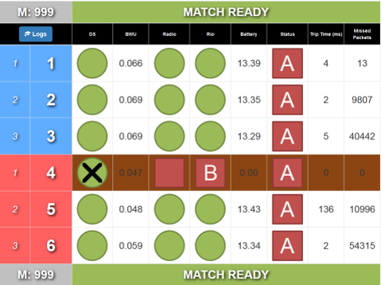
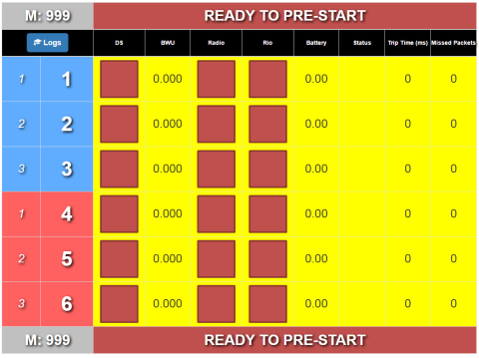
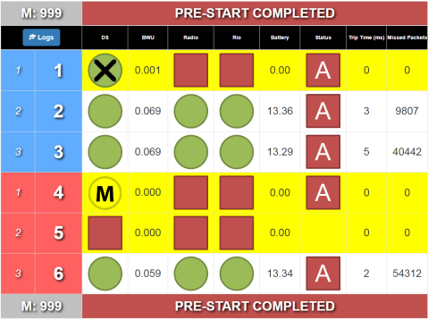
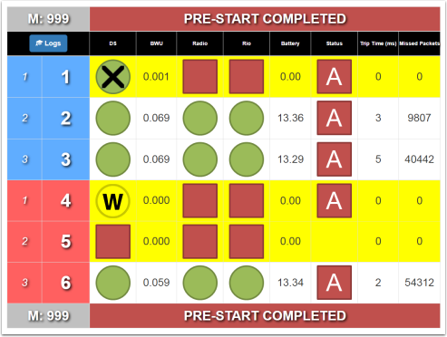
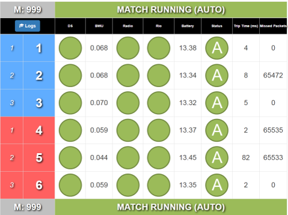
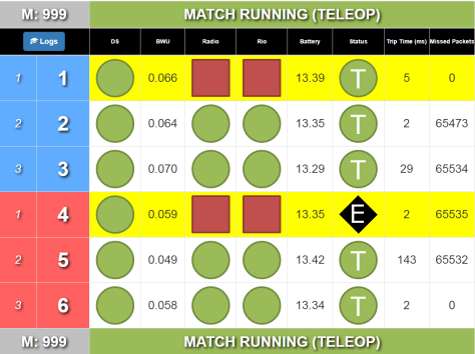
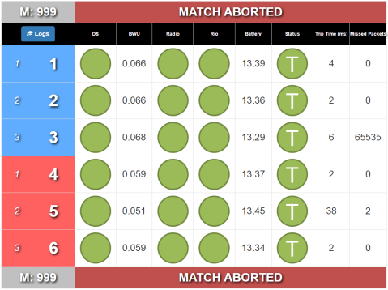
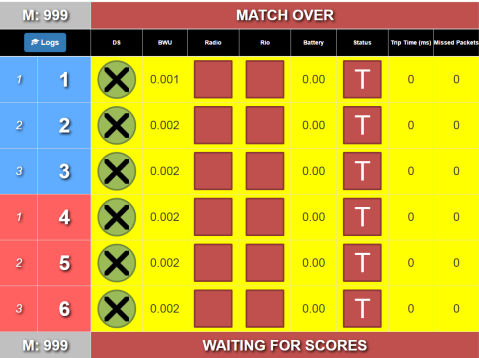

Live Monitor
============

Watch robot status as it happens. The Field Monitor is part of the web interface, accessible through the webpage at 10.0.100.5 (normally)

Basic Layout
------------

The Field Monitor program shows the same details as the Status tab available in Match Test and Match Play.

The match number and match status are displayed across the top and bottom of the Field Monitor screen. Occasionally, the top and bottom status bars will not display the same information, such as when the text is too large for one line (it will show part of the status on each line). In the middle are details about each team. From left to right, the details on the Field Monitor are:

* Player Station - The first number indicates the station, the second number is the team in that station. Example: Team #6 is in station Red 3

   * Example: Team #6 is in station Red 3

DS - DS is in FMS mode (i.e. connected to FMS) when a green circle is shown. A green circle with a black X indicates that the computer is plugged in but the DS software is not linked (full FMS only).

BWU - Indicates the Bandwidth Utilization/Consumption for that particular team

Radio - Indicates that the DS is able to reach the radio on the robot

Rio - Indicates that the DS is able to reach the roboRIO on the robot

Battery - Battery voltage reported by the Robot

Status - The state and mode of the robot. “A” indicates Autonomous, “T” indicates Teleoperated. A red square means the robot is disabled; a green circle is shown when enabled. A black diamond with an “E” is shown for an e-stopped robot

Avg Trip - The average time required to send a message to the robot and have the robot respond (this is basically like a ping.) Units are in milliseconds.

Packets - indicates the number of packets dropped in the DS-to-Robot link. Typically there are some lost packets. In a very tame wireless environment, this number will be less than 100. (Note: this number can “underflow” to ~65000 which does not indicate an issue)

Below are many potential Field Monitor states are shown (but not an exhaustive list)

Prior to Prestart
-----------------

Rows remain yellow until the DS and Robot have fully linked with FMS, at which point the row turns white. If the team is Bypassed, the row turns brown (see above).

Pre-Start Complete
------------------

Team 1 has something plugged in, but not a DS (or DS software is not yet open).

Team 5 is actually plugged into Team 4's Driver Station, and so a yellow "M" is shown on Team 4 which signifies that whoever there must "MOVE" (because it's not Team 4). The team's DS will indicate that they are plugged into the incorrect spot and should move to the correct Driver Station.

In this example, the team in Station 4 has a team number that is not one expected in the match. Teams expected are 1,2,3,4,5,6, and the team number plugged into Station 4 is Team 8. So this team gets a yellow "W" circle, that means, "Wait your Turn." This can also happen when a team for the next match plugs in to a Player Station prior to a prestart.

Match Ready
-----------

Team 4 is Bypassed in this example.

Match Running
-------------

Match Running (Estop and Disconnect)
------------------------------------

In this example, team 4 has pressed their Estop, and team 1 has dropped robot communication (and Radio communication).

Match Cancelled
---------------

Shown after a cancel match button is pressed, or the Arena Estop. It will return to "Ready for Prestart" promptly.

Match Over
----------

All teams are dropped when the match finishes (in many cases, their DS would remain connected, hence the Green X marks)
