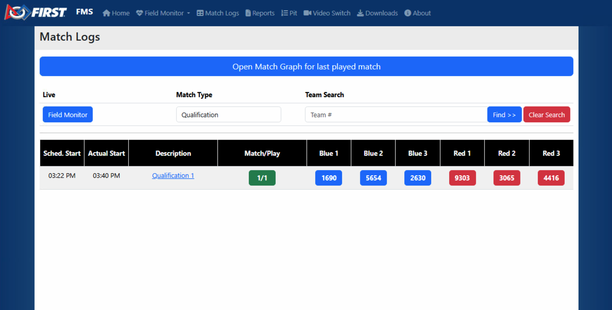
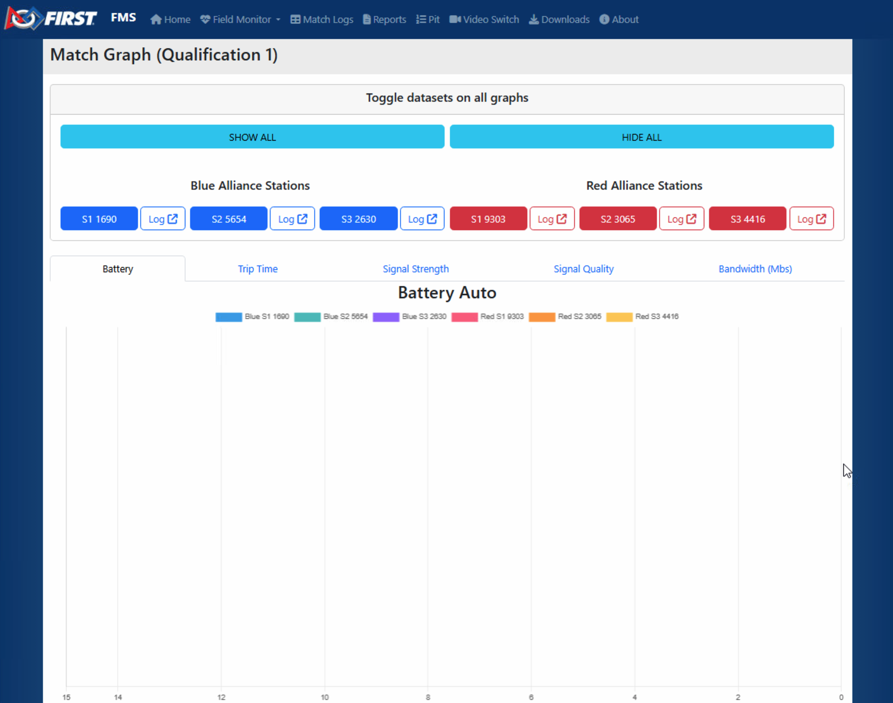
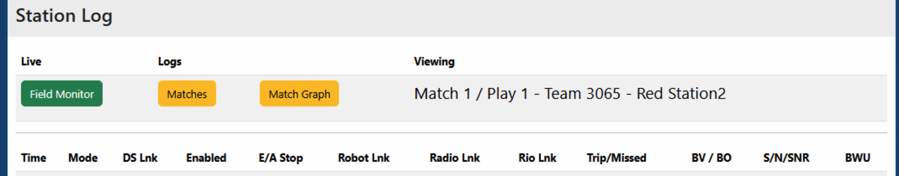
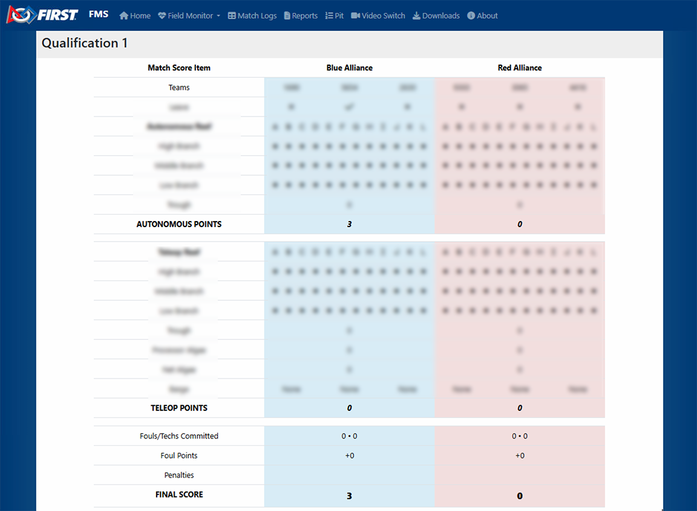

.. _field-monitor-logs-scores:

Match Logs and Scores
======================

Access
------

| 
| Selecting the Match Logs button in the upper left hand corner of the Field Monitor presents a list of all completed matches. Users can select the Match 
    Type using the dropdown box in the top center and then scroll to the desired match or search by team using the box in the top right. Clicking the green "Match/Play" 
    button for a match will pull up the match graphs. Clicking an individual team button will pull up the station log for that match. Click the Field Monitor button to 
    go back to the standard (Simple) Field Monitor display. Clicking on the Match Description will bring up the scoring details, as described later.

Match Graph
-----------

|
| Clicking a match number from the logs page will bring up the Match log page. The Match log page has tabs to view diagnostic information for each team in a match on a graph. 
    On a full FMS setup it will display Signal Strength (SS), Signal Quality (SQ), and Bandwidth Utilization (BWU) in addition to the battery and trip time. 
    Add or remove a team from the chart by clicking their station/team number, and navigate the tabs to view the various charts. 
    The top chart is for Auto and the lower chart is for Teleop.

Station Log
-----------

|
| Clicking the "Log" button next to a team number from the logs page will bring up the Station Log. The station log contains a table of timestamped entries of the data shown on the Field Monitor 
    during the match (+SS/SQ for a full field). This detail page is accessed by clicking the Team number (blue or red buttons) on the "Matches" page.

Score Detail
------------

|
| Scoring details can be viewed from the match logs interface, freeing the scorekeeper to continue running matches instead of entering Match Review. No edits can be made through 
    the web. All information on the score detail page is considered "for reference only" and the only official source of information remains the Scorekeeper.

The Score Detail shown here is in a slightly different format than the data shown on the frc-events website (to the public). This is also where FMS shows the string it 
transmitted to the Robots (in the blue box at the top of the page) for seasons with a game-specific data transmission.
