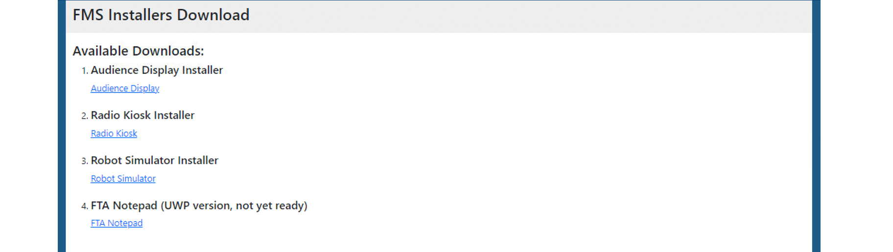

.. _field-server-downloads:

Downloads
======================

Several commonly downloaded programs are stored on the field server for quick access without requiring an internet connection (as not all events have internet access).
It is recommended to download files to the server and place them on a USB Stick, or download the to a machine that is connected via Ethernet to the field network.

* Audience Display Download - exe installer to turn a target machine into a remote Audience Display
* Radio Kiosk Installer - exe installer to turn a target machine into a radio kiosk to program team radios for use on the playing field
* Robot Simulator Installer - exe installer to turn a target machine into a robot simulator to verify field access point operation
* FTA Notepad - mobile application for use of FTAs. Not yet available, and requires an FTA login username/password.

.. warning::
    Do not install the Audience Display on the FMS Server's owned by FIRST HQ
