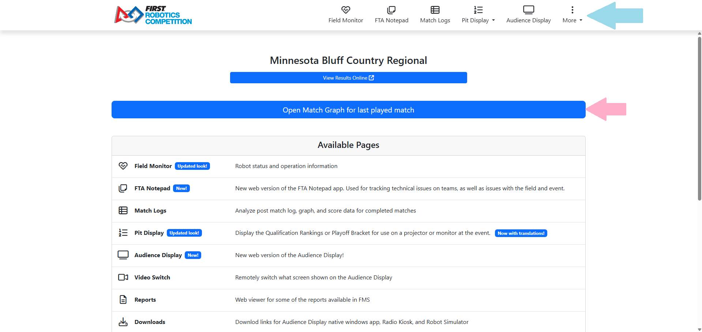
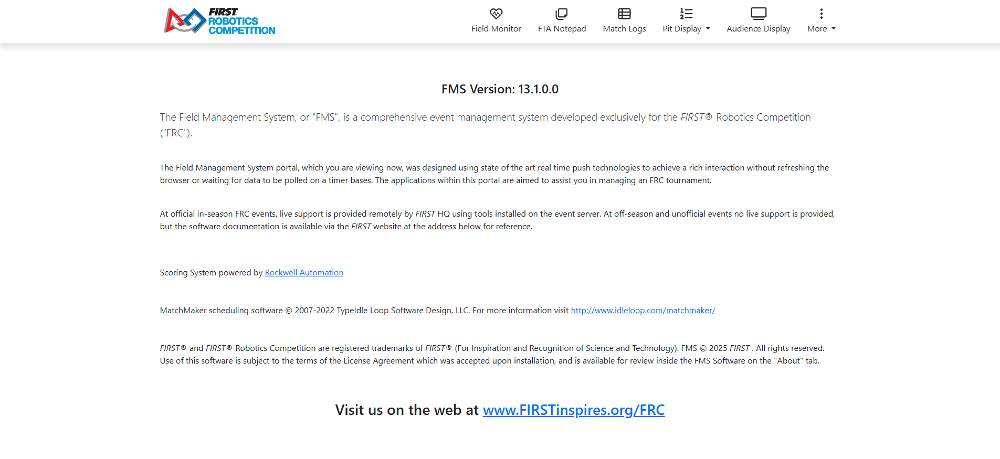

.. _field-server-web:

Field Server Website
======================

The website on the FMS Computer contains helpful resources for troubleshooting robot connectivity and reviewing event information.

[*Blue Marker*] The navigation bar allows access to the server web resources

[*Pink Marker*] Quickly jump to the logs of the most recently committed match

The pages found on the Field Server Website are outlined below:

* Field Monitor - Robot to field connectivity status (:ref:`view connectivity guide <field-monitor-connectivity-guide>`)
* FTA Notepad - System for FTAs to track technical issues with robots and the field, detailed :ref:`on this page <fta-notepad-login>`
* Match Logs - Match logs and scores, detailed :ref:`on this page <field-server-logs-scores>`
* Pit Display - Qualification and Playoff ranking data, detailed :ref:`on this page <pit-display-display-index>`
* Audience Display - Web-based Audience Display, detailed :ref:`on this page <audience-about-web-index>`
* Reports - Similar functionality to the Reports tab in FMS, detailed :ref:`on this page <field-server-reports>`
* Video Switch - Change the graphic on the Audience Display(s), detailed :ref:`on this page <field-server-video-switch>`
* Downloads - Download commonly used tools and programs, detailed :ref:`on this page <field-server-downloads>`
* Help - Various helpful links to documentation
* About - Version and license information, shown below

