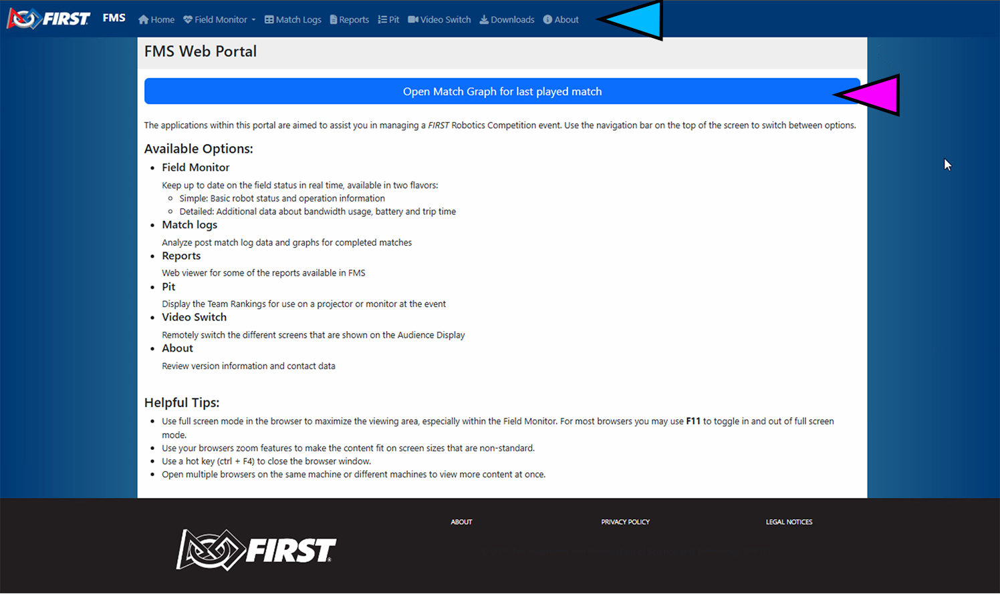

.. _field-server-web:

Field Server Website
======================

The website on the FMS Computer contains helpful resources for troubleshooting robot connectivity and reviewing event information.

[*Green Marker*] The navigation bar allows access to the server web resources

Field Server Web
##########################

* Field Monitor - Robot to field connectivity status, detailed :ref:`on this page <field-monitor-live-index>`
* Match Logs - Match logs and scores, detailed :ref:`on this page <field-monitor-logs-scores-index>`
* Manual Scoring - In some games, backup for the automated scoring hardware
* Reports - Similar functionality to the Reports tab in FMS, detailed :ref:`on this page <field-server-reports>`
* Pit - Qualification and Playoff ranking data, detailed :ref:`on this page <pit-display-display-index>`
* Video Switch - Change the graphic on the Audience Display(s), detailed :ref:`on this page <field-server-video-switch>`
* Downloads - Download commonly used tools and programs, detailed :ref:`on this page <field-server-downloads>`
* About - Version and license information, shown below

