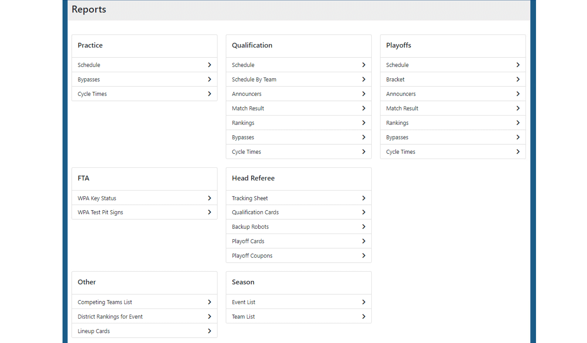

.. _field-server-reports:

Field Reports
======================

Reports can be viewed from the field server similar to how they can be accessed via the :ref:`Reports tab <reports-reports-index>` in FMS.

Click on a report to open it in the browser based viewer.

The browser viewer frame is nearly identical to the one inside FMS.

For additional operations, such as print or export, see the :ref:`Report Operations <reports-operations>` page
