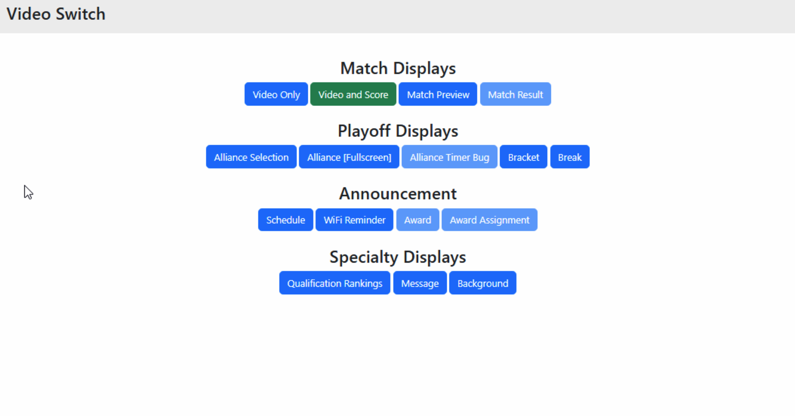

.. _field-server-video-switch:

Video Switch
======================

The output of the Audience Display(s) on the field network can be changed using the video switch buttons.
A green background is applied to the display that is curently showing on the Audience Display(s). 
Some displays cannot be activated from the web version and are shown as disabled.

Messages cannot be displayed from the field server web, they must be displayed from within FMS.
