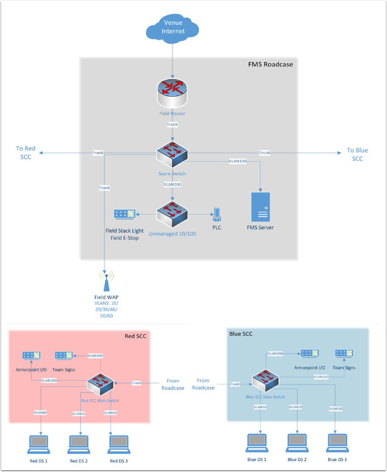

.. include:: <isonum.txt>

FMS Whitepaper
==============

The purpose of this document is to provide an insight to the functional structure and method by which the FIELD MANAGEMENT SYSTEM (FMS) is implemented on a typical FRC\ |reg| field. All rules information should be directed to the season-specific FRC Game Manual, as that is the authoritative source for rules and regulations. This document is purely for informational purposes.

Role of the Field Management System (FMS)
-----------------------------------------

The FIELD MANAGEMENT SYSTEM (FMS) is the electronics core responsible for controlling the *FIRST*\ |reg| Robotics Competition (FRC) playing field. The FMS encompasses all field electronics, including the Field Management server, Referee Panels, Field Access Point, Team Stack Lights, Emergency Stops, etc. Additional hardware and software components may be added to the FMS for each years’ challenges.

The FMS is also responsible for coordinating control of the Driver Stations and robots during a match, as well as providing the pipeline for them to communicate. The FMS also provides the infrastructure for real-time score-keeping, and logs diagnostic data during the event. Finally, the FMS provides data to the Audience and Pit Displays.

The FMS is based on Ethernet architecture. End devices such as the Driver Station, Referee Panels and other field components communicate over a wired Ethernet interface. Numerous other field electronics (such as Stack Lights and Emergency Stops) also connect to devices that, in the end, communicate over Ethernet to the rest of the network. Wireless communications (WIFI) is only used to communicate with the robots during a match.

Although the FMS Field Network is all on one physical network, this physical network is split into Virtual Networks (VLANs), to ensure each team’s communications are independent from other teams, as well as the rest of the field electronics.

The goal of the FMS is to provide a unified, secure and robust solution to running FRC matches in a fair and consistent manner. Many protocols and procedures are put in place to ensure the FMS is operational and running to full capacity.

The Field Network
-----------------

Components
^^^^^^^^^^

The FMS is made of many components, all working together in unison to provide the full functionality of an FRC field. This section contains most, but not all, of the field electronic components and has been generalized to be season-agnostic.

The Field Router
~~~~~~~~~~~~~~~~

The Field Router is located inside the FMS roadcase, and is used to provide the FMS network with an internet uplink to the venue connection, route all cross-network traffic, and establish routing rules and VLAN configurations. The Field Router does not directly connect to any other member of the network other than the Score Switch. All active interfaces on the Field Router are 10/100/1000 Gigabit Ethernet.

The Score Switch
~~~~~~~~~~~~~~~~

The Score Switch is located inside the FMS roadcase, and is the central point for all communications on the Field network. The Score Switch connects the Station Control Cabinets (SCCs), Field Access Point, FMS server and a secondary, unmanaged 10/100 Fast Ethernet switch, which connects to the Arena Stack Light and Programmable Logic Controller (PLC). All interfaces on the Score Switch are 10/100/1000 Gigabit Ethernet.

Another 10/100/1000 Switch is located external to the FMS roadcase, usually located on the scoring table. This switch connects to the Score Switch and is used to interconnect Referee Panels, Pit/Audience Displays and the *FIRST* Technical Advisor (FTA) Field Monitor.

The FMS Server
~~~~~~~~~~~~~~

The FMS server runs the FMS software, and is connected directly to the Score Switch. The FMS server is responsible for managing field play, scoring, field control, as well as the Audience and Pit displays. It also provides the FMS graphic overlay used on the video displays at the event. The FMS also manages the Driver Stations of each alliance.

The FMS server does not communicate directly with the robots. All communication is between the FMS server and the Driver Station, including states (Enabled, Disabled, Teleop, Auto, etc), Emergency Stop status, Match Time, and more. If the Driver Station loses connection with the FMS software, the watchdog function onboard the robot halts control and disables the robot.

The FMS server also collects diagnostic status from Driver Stations, field electronics, robot radios, and the National Instruments roboRIO to diagnose issues and log match play. This data includes, but is not limited to, ping status, robot code status, packet trip time, bandwidth utilization and battery voltage. All robot data is first communicated from the robot to the driver station, and then from the driver station to the FMS server.

There is a second FMS server included with the field that can be swapped out as a spare at any time. The configurations for both are identical.

The Programmable Logic Controller (PLC)
~~~~~~~~~~~~~~~~~~~~~~~~~~~~~~~~~~~~~~~

The Rockwell Automation Programmable Logic Controller (PLC) is located inside of the FMS roadcase, and is responsible for keeping track of the field scoring equipment. Over Ethernet, the PLC communicates with other field electronics (many of which are season-specific) to keep score count, and update the FMS server. This offloads some of the work done by the FMS server and allows much more advanced control over other season-specific field electronics.

Station Control Cabinet (SCC)
~~~~~~~~~~~~~~~~~~~~~~~~~~~~~

Each alliance on the field, red and blue, has its own Station Control Cabinet (SCC). A 3\ :sup:`rd`\, spare SCC is included with the field. There are 2 versions of the SCCs in use at FRC events, but the functionality is the same.

Version 1 contains a primary Ethernet switch connected to the Score Switch with a 10/100/1000 Gigabit Ethernet trunk line, and one secondary Power over Ethernet (PoE) 10/100 Fast Ethernet switch.

Version 2 contains one 10/100/1000 Gigabit Ethernet Switch capable of Power over Ethernet (PoE), connecting to the Score Switch with a 10/100/1000 Gigabit Ethernet trunk line. There is no secondary switch. Version 2 was introduced at the start of the 2017 season.

All switches in the SCC are managed switches.

Each Driver Station connects to a dedicated a port on the “main” switch. Each of these ports is assigned its own VLAN interface. In Version 1, this is a 10/100 Fast Ethernet connection, in Version 2 the connection is 10/100/1000 Gigabit Ethernet.

On each SCC, a port on the primary switch is dedicated to the LED Team Signs (+ Timer LED Sign), as well as to the Rockwell Automation Armorpoint I/O device used to connect the Driver Station Stack Lights and Emergency Stop buttons.

Ports on the secondary switch (or main switch in version 2) are dedicated to other miscellaneous equipment, such as Referee Panels, lighting controllers, or MiniSCCs, used to control other field devices, such as scoring devices located in the Alliance Stations. Devices outside the core infrastructure of the playing field network are not discussed in this whitepaper.

The Field Wireless Access Point
~~~~~~~~~~~~~~~~~~~~~~~~~~~~~~~

The Field Wireless Access Point (WAP) broadcasts and receives wireless data from robots on the playing field. The Field WAP hosts a hidden SSID for each robot scheduled to play on the field, all of which are multiplexed over a single wireless interface. Each SSID is allocated a VLAN to the corresponding Driver Station.

The Field WAP connects to the Score Switch through a 10/100/1000 Gigabit Ethernet trunk line. The switch ports on the Field WAP are unused and unallocated, only the WAN (trunk) line is used.

The Field WAP uses the 802.11n Wi-Fi standard, and the 5GHz band is reserved exclusively for robots. The standard configuration employs a 20MHz channel, with the option for 40MHz, and employs WPA2/AES encryption with a unique key per team, per event.

Referee Panels
~~~~~~~~~~~~~~

There are typically multiple Referee Panels located around the field. There is no standard configuration or location for these panels as it dictated by the season’s game. It is common for there to be at least 5; 3 on one side, and 2 on the other. The panels are used to input fouls, tech fouls, yellow and red cards during the match, as well to award points that are not scored automatically.

The Head Referee panel includes controls for the LED light strings on the playing field, declaring when it is safe for field staff and team members to enter the field, and to initiate a referee review of the match.

Robots
~~~~~~

Each robot contains, at minimum, a wireless radio and robot controller (roboRIO). The wireless radio is configured in bridge mode to communicate to the Field WAP using an assigned SSID and WPA Key, which then communicates with the robot controller and any other devices on the robot at the discretion of the team. At each event, each team is assigned a unique encryption key.

The robot radio is responsible for connecting to the field, as well as implementing the bandwidth limit. Each team must configure their radio at the event before it will successfully link with the Field WAP. Radio configuration kiosks are provided for this purpose.

Additional Non-Field Components
~~~~~~~~~~~~~~~~~~~~~~~~~~~~~~~

Additional devices may be introduced to the Field Network at the FTA’s discretion, such as a tablet or mobile device used by the FTA to view diagnostic information, logs, etc. while on the field prior to the start of a match. This is commonly used to monitor a robot’s connection state, and is often used when troubleshooting a robot that does not connect to the field. It is also used during matches if a robot suddenly loses connection or experiences problems. The Game Announcer may also connect to the Field Network to access and provide up-to-the-minute team statistics to relay during the match.

These wireless devices operate only on the 2.4GHz wireless network and do not overlap with robot communications.

Field Network
^^^^^^^^^^^^^

The figure below shows a basic network diagram of the FMS field network setup. VLANs have been labelled to indicate how networks are separated. Robots and other equipment are excluded from this diagram.

VLANs and Network Policy
^^^^^^^^^^^^^^^^^^^^^^^^

The FMS field network is split into multiple networks using VLANs, a method by which data is encapsulated on the trunk lines, and then distributed at the switch based on its configuration. This is employed on the field to ensure each teams’ connection to their respective robot is private from other teams on the field.

The Field Router sets up the VLANs 10, 20, 30 (Blue), 40, 50, 60 (Red) and 100 (Admin). The switches (and Field WAP) then assign specific ports (or SSIDs, in the case of the Field WAP) to each VLAN, allowing that port to become isolated form the rest of the network. Each VLAN consists only of the Robot, the Driver Station, and the FMS server. The FMS server is a part of the Admin VLAN, but the Field Router is configured to permit it communication with the Driver Station of each VLAN.

The Admin VLAN is the only VLAN capable of reaching the venue Internet. This allows the FMS server to upload match results and awards information to *FIRST* servers, as well as download team information. The Admin VLAN is not accessible to robots and driver stations.

Addressing
^^^^^^^^^^

The Field Router does not provide a DHCP server to the rest of the Field Network. Instead, this is handled by the FMS server, with 7 DHCP pools being allocated (one for each VLAN). The 6 team DHCP pools change depending on what teams are scheduled for that match (10.TE.AM.xx). The Admin VLAN has mostly statically addressed devices, with some, such as Referee Panels, running on DHCP.

Team IP addresses follow the 10.TE.AM.xx scheme, and are dynamically addressed with DHCP unless otherwise configured by the team. Prior to the beginning of the match, the FMS server sends new configuration parameters to the switches on the field, to reconfigure their VLAN settings to accept the new IP addresses. The Field Router and Field WAP are also reconfigured using this process. The Prestart process is described at length later in this paper.

Network Bandwidth
^^^^^^^^^^^^^^^^^

The FMS Field Network has limited bandwidth available. There is an imposed 4Mbit/s limit for each team via the robot radios to ensure no one team overloads the system, causing packets to drop for other teams. Given that each wireless SSID that the Field WAP handles is multiplexed, this adds up to a total of 4x6=24Mbit/s for the Field WAP. All other traffic on the FMS Field Network is not limited by bandwidth.

The Robot Radio prioritizes certain communications over others. Driver Station control and status packets are the highest priority, followed by Network Tables, then all other traffic (e.g. video).

Driver Station and Robot Communications
^^^^^^^^^^^^^^^^^^^^^^^^^^^^^^^^^^^^^^^

The Driver Station to Robot Communication is identical to that of a system without the FMS in terms of packets. The only difference is that on an FMS network, the packets are routed through the FMS Field Network, then to the Robot. These packets include control data for your robot, telling it what state it should be in and what the values of the joysticks are. The FMS does not send any packets to your robot.

The following ports are opened for communication between your Robot and Driver Station. All other ports are blocked. All ports are bidirectional unless otherwise stated.

* UDP/TCP 1180 - 1190: Camera Data
* TCP 1735: SmartDashboard
* UDP 1130: DS-to-Robot control data
* UDP 1140: Robot-to-DS status data
* HTTP 80: Camera/web interface
* HTTP 443: Camera/web interface (secure)
* UDP/TCP 554: Real-Time Streaming Protocol for h.264 camera streaming
* UDP/TCP 5800-5810: Team Use

Teams are permitted to utilize ports 5800-5810 for their own purposes, or any other open ports (other than 1130 and 1140) if not already allocated.

Your robot will report data about itself to the Driver Station, which is then, in turn, forwarded to the FMS. This includes data about your robot including what motors are being used, what language it was programmed in, and other metadata. This is then forwarded to *FIRST* for statistical purposes. This process is known as “Usage Reporting”, and is discussed at length later in this whitepaper.

The FMS server communicates to the Driver Station through the Field Router, with a routing exception, allowing the FMS server to send data to the team VLAN. This includes critical data, such as what state the robot should be in, match time, and other details. The Driver Station also sends data back, such as battery voltage. Logging of data is discussed at length later in this whitepaper.

Logging and Data Collection
---------------------------

Robot and Driver Station Logging
^^^^^^^^^^^^^^^^^^^^^^^^^^^^^^^^

During the match, the Robot forwards data about itself to the Driver Station, such as battery voltage. The Driver Station combines this with its own log data and forwards it to the FMS server. All this log information, along with diagnostic data from the field, is combined to produce a log that can be read by the FTA during, or after, a match in order to diagnose potential issues. Below is a list of all data that is logged by the FMS.

* Timestamp (local time)
* Match Number
* Team Number
* Match Time
* Alliance
* Mode (Auto/Teleop)
* DS in FMS Mode (yes/no)
* Robot Mode (enable/disable)
* Estop state (on/off)
* Robot Link (yes/no)
* Bandwidth consumption over the wireless link
* Strength of the signal transmitted by the robot radio
* Signal-to-Noise Ratio of the wireless link
* Average packet trip time between DS and Robot
* Number of missed packets between DS and Robot
* Total number of packets sent by DS to Robot
* Robot Battery Voltage

Usage Reporting
^^^^^^^^^^^^^^^

At the beginning of the match, the Robot forwards some Usage Reporting data to the Driver Station, which in turn reports it to the FMS server, which in turn reports that to *FIRST* HQ’s servers. This data is collected throughout the season and usually released at the end of the season to give some statistics and insight into what teams are using. The data included in Usage Reporting is, but not limited to, the following:

* Motor Controllers used
* Programming Language
* Accelerometers / Gyros used
* Joysticks Used
* RobotDrive class used
* Smart Dashboard used
* Ultrasonic devices used
* I2C/SPI used

Field Status Indicators
-----------------------

Team Stack Lights
^^^^^^^^^^^^^^^^^

On the field are located 6 stack lights, one per team. Each stack light contains two LED sections equal to the alliance color (red or blue), and an additional amber LED used to indicate Emergency Stop status. Below is a table representing the state of the stack lights and what they indicate.

+----------+--------------------------------------------+----------------------------+
|          | Alliance Color                             | Amber Color                |
+----------+--------------------------------------------+----------------------------+
| Flashing | No connection to robot or station bypassed | N/A                        |
+----------+--------------------------------------------+----------------------------+
| Solid    | Robot Enabled                              | Estop pressed/enabled      |
+----------+--------------------------------------------+----------------------------+
| Off      | Connection Established to Robot            | Estop not pressed/disabled |
+----------+--------------------------------------------+----------------------------+

Field Stack Light
^^^^^^^^^^^^^^^^^

The field has its own stack light that is typically used by the FTA and Field Staff to determine what state the field is in. There are 4 LEDs on the stack light, and a buzzer. Below is a table representing the state of the stack lights and what they indicate.

+----------+-----------------------------+--------------------------------------------------------+---------------------------------------------------------+---------------------------------------------------+-------------------------------------------------------------------------+
|          | Green LED                   | Red LED                                                | Blue LED                                                | Amber LED                                         | Buzzer                                                                  |
+----------+-----------------------------+--------------------------------------------------------+---------------------------------------------------------+---------------------------------------------------+-------------------------------------------------------------------------+
| Flashing | Match Ready                 | N/A                                                    | N/A                                                     | *During Match:*                                   | Match Ready (single chime, coincides with green LED beginning to flash) |
|          |                             |                                                        |                                                         | Scoring malfunction (e.g. jammed, sensor blocked) |                                                                         |
|          |                             |                                                        |                                                         |                                                   |                                                                         |
|          |                             |                                                        |                                                         |                                                   |                                                                         |
|          |                             |                                                        |                                                         | *Post Match:*                                     |                                                                         |
|          |                             |                                                        |                                                         |                                                   |                                                                         |
|          |                             |                                                        |                                                         | Waiting for Referee                               |                                                                         |
+----------+-----------------------------+--------------------------------------------------------+---------------------------------------------------------+---------------------------------------------------+-------------------------------------------------------------------------+
| Solid    | Match running/Field enabled | Red Alliance not ready (e.g. not all robots connected) | Blue Alliance not ready (e.g. not all robots connected) | N/A                                               | N/A                                                                     |
+----------+-----------------------------+--------------------------------------------------------+---------------------------------------------------------+---------------------------------------------------+-------------------------------------------------------------------------+
| Off      | Match not Ready             | Red Alliance ready (all robots connected)              | Blue Alliance ready (all robots connected)              | *Pre-Match Start:*                                | Waiting for Match Ready                                                 |
|          |                             |                                                        |                                                         |                                                   |                                                                         |
|          |                             |                                                        |                                                         | Referee Ready                                     |                                                                         |
|          |                             |                                                        |                                                         |                                                   |                                                                         |
|          |                             |                                                        |                                                         |                                                   |                                                                         |
|          |                             |                                                        |                                                         | *Post-Match:*                                     |                                                                         |
|          |                             |                                                        |                                                         |                                                   |                                                                         |
|          |                             |                                                        |                                                         | Referee Done                                      |                                                                         |
+----------+-----------------------------+--------------------------------------------------------+---------------------------------------------------------+---------------------------------------------------+-------------------------------------------------------------------------+

The Match Play Process
----------------------

Match Prestart
^^^^^^^^^^^^^^

During Prestart, configurations are deployed to the networking systems that comprise the FMS to setup team-specific VLANs, IP addresses, security settings, etc. During this time, the LED signs on each Player Station are updated to reflect the teams configured to play in the upcoming match.

After Prestart, each Driver Station connected to the FMS displays “FMS Connected” on the dashboard software. If a team is located in the wrong Player Station, the dashboard software indicates the correct Player Station to which the team should move.

A match cannot start until the state of all Player Stations is known. The two states which permit a match to start are:

#. The Driver Station configured for the Player Station is connected and linked with the FMS and the corresponding robot is linked with the Driver Station
#. The Player Station is bypassed. The *FIRST* Robotics Game Manual outlines the specific rules outlining when a team is eligible to participate in a match. For the sake of this whitepaper, we are using the lower-case term bypass to define only the state of the Player Station from a software perspective.

Match Play
^^^^^^^^^^

During Match Play robots are enabled, scoring mechanisms activated, Referee panels enabled, and the FMS audience screen is displayed. The scoring mechanisms communicate with the FMS server directly, or with the PLC located in the FMS roadcase, which in turn communicates with the FMS server.

A match is stopped by cancelling it via the FMS software interface or by pressing the Field Emergency Stop button located on the Scoring Table. When stopped, all robots are immediately disabled, scoring mechanisms stopped, and the foghorn sound played.

Match Scoring
^^^^^^^^^^^^^

Matches are scored via Rockwell Automation sensors and counters that link back into the PLC, which tells the FMS the counts and different game states. Other sensors may be used depending on the season’s field configuration.

Once the FMS has received the final penalties/scoring, the scorekeeper waits for the head referee for any changes to the score last minute, and then submits the score.

Match Publishing
^^^^^^^^^^^^^^^^

Provided an event has an internet connection available, the FMS server uploads match data upon completion of a match following the Match Scoring process to an Azure MS SQL Database.

If the event does not have Internet available, event data is backed up to a USB drive. The FTA at the event then uploads the event database as possible to HQ for posting to Azure.

The database is queried via the FMS API (Documentation available here: `https://usfirst.collab.net/sf/projects/first_community_developers/ <https://usfirst.collab.net/sf/projects/first_community_developers/>`__ ) and is available to users who request access.

The data model is year specific, due to game scoring breakdowns being available.
