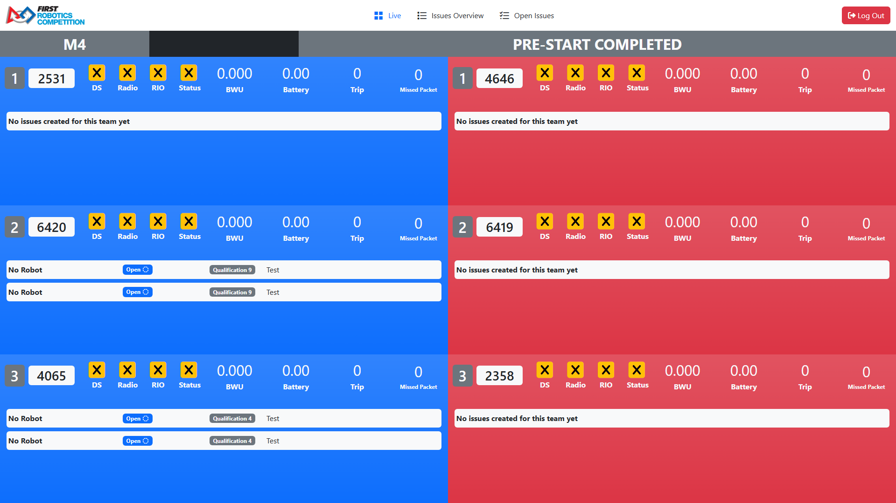
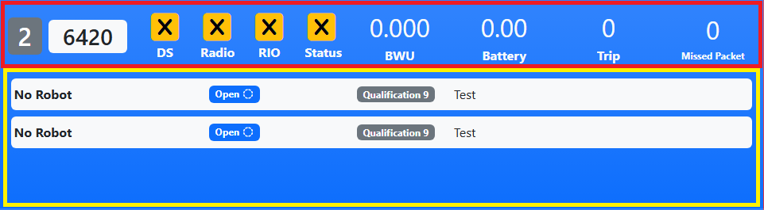
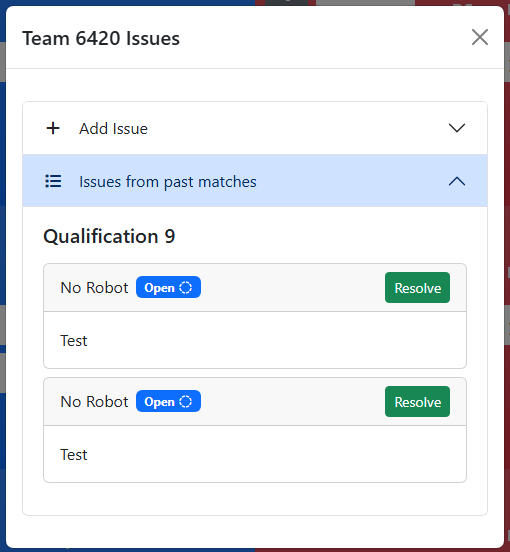
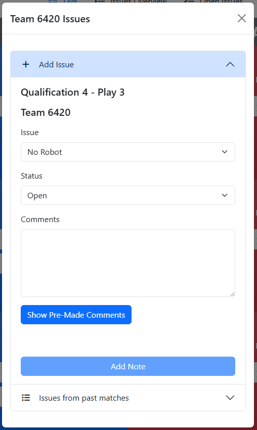
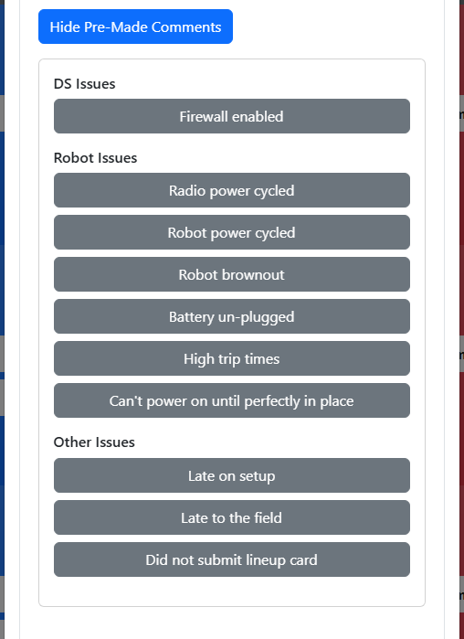
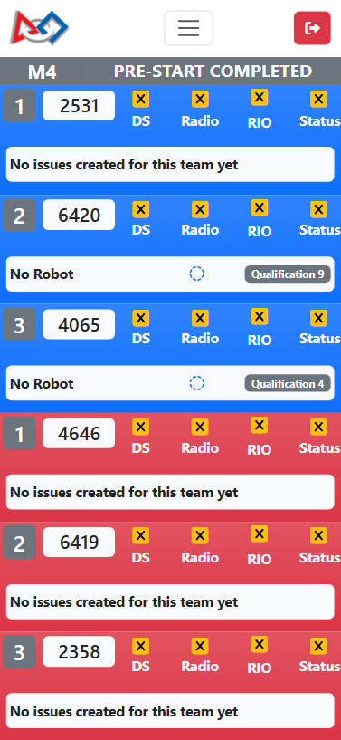

.. _fta-notepad-live:

Live
====

The Live page shows information on the robots in the current match in FMS and is designed as a modified version of the Field Monitor. Please visit :ref:`this page<field-monitor-connectivity-guide>` for more information on how the live robot status indicators work.

On each station there are two areas of information.

[*Red Square*] - Live-updating status information, similar to the Field Monitor.
[*Yellow Square*] - Issues created for this team in matches at the event, sorted by the current match first and sorting by Open issues first then resolved issues.

Click or tap on the area where the issues are (or would be, if there are no issues) to open a dialog that displays all active issues for the team at the event. In this dialog there is also a section to create new issues for the current match for the team.

The issues are sorted by match, and each have a "Resolve" button on them for the user to quickly resolve an issue.

When adding a new issue for the current match, the user can choose the issue type, status, and enter comments. There is a button to show "Pre-Made" comments.

Each Pre-Made comment is a button. When clicked, it adds the text from the button to the comments box on a new line.

Live page on a phone screen (iPhone 12 Pro used for screenshot):

