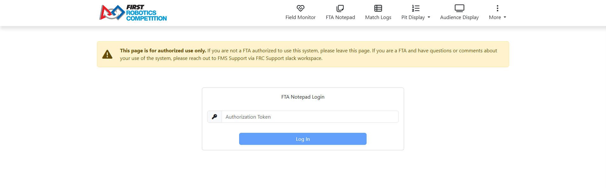

.. _fta-notepad-login:

Login
=====

Use this page to log in to the FTA Notepad application. FTAs will be sent an authorization token before each event and can also reach out to FMS Support for the token. This code can be used on as many devices simultaneously as the FTA wants. Once logged in, the website will redirect to the 'Live' page of the FTA Notepad application.

.. note::
    If the user enters 'CSA' for the authorization token, it will log in to the FTA Notepad application in read only mode.