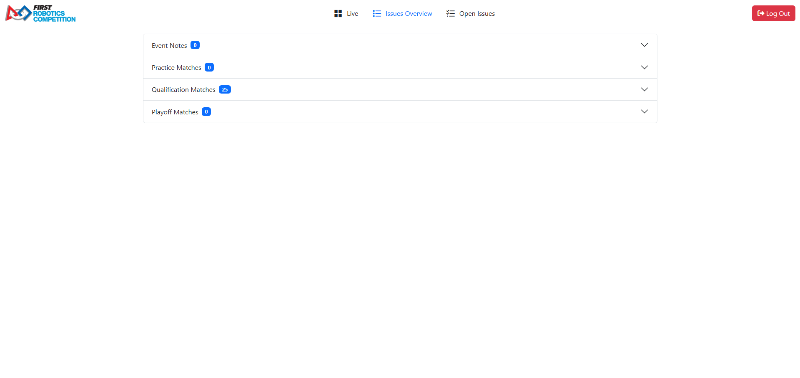
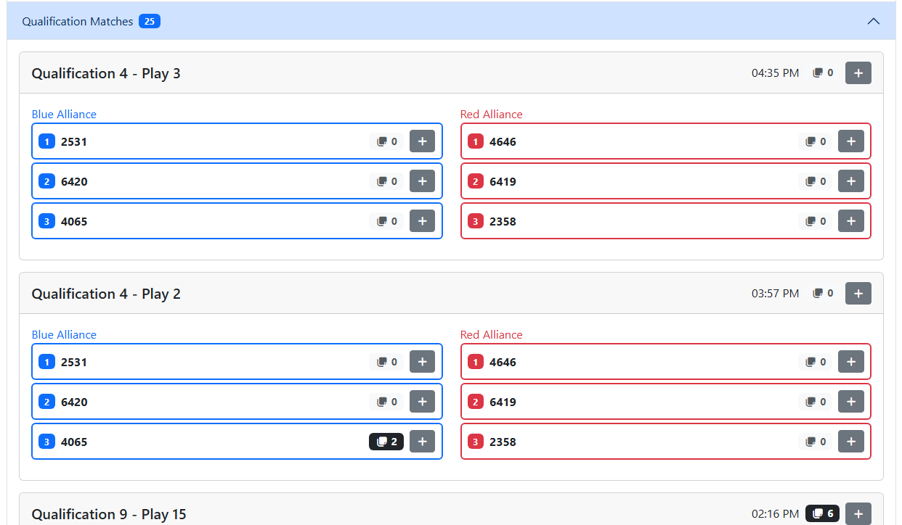
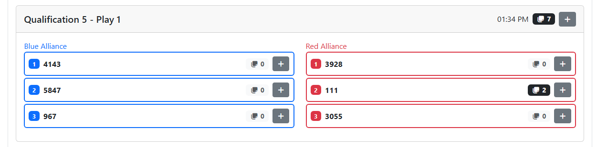
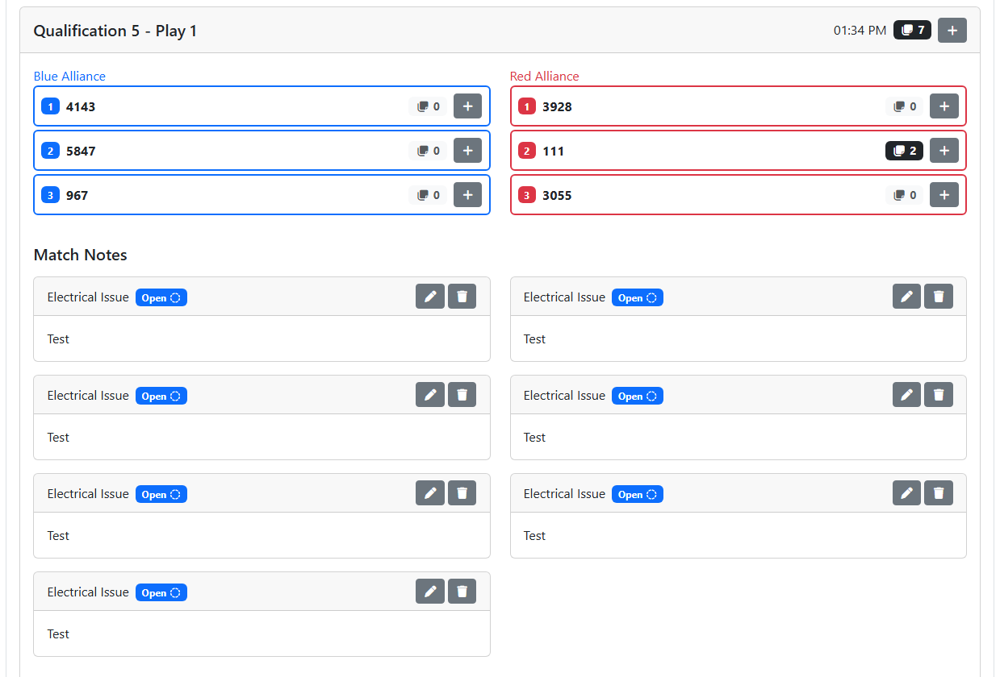
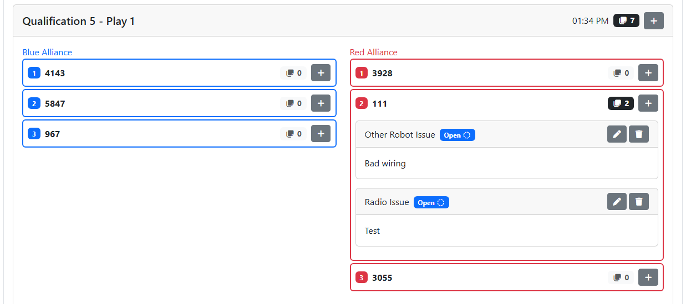
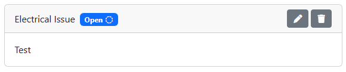
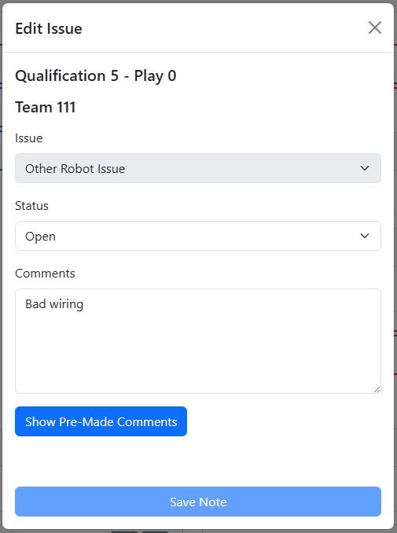

.. _fta-notepad-overview:

Issues Overview
===============

The Issues Overview page shows issues created on all matches played in the event and allows the user to edit them or create new issues.

| 
| Expanding one of the tournament levels will list all matches played so far in the event for that tournament level.

| 
| Each match will show the following information:

* Match Name
* Play Number
* Time played
* Number of issues created for the match (not team specific)
* Button to add match issue
* Blue stations
* Red stations

Each station will show the following information:

* Station Number
* Team Number
* Number of issues created for this team in the match
* Button to add team match issue

| 
| Click or tap anywhere in the "header" of the match to view the issues for the match.

.. note::
    If there are no issues for the match, clicking or tapping the header will do nothing.

| 
| Click or tap on any of the stations to view the issues for that team in the match.

.. note::
    If there are no issues for the team in the match, clicking or tapping the station will do nothing.

The issues counter on the match and all the stations in the match will be gray with a light gray background if there are no issues. The counter will be white with a black background if there are more than zero.

| 
| Each issue shows the following information:

* Issue Type
* Status
    * Blue badge with dashed circle icon and "Open" label for an issue that is still open
    * Green badge with check icon and "Resolved" label for an issue that has been resolved
* Action buttons
    * Pencil icon button to edit an open issue
    * Circle arrow icon button to reopen a resolved issue
    * Trash can icon button to delete an issue
* All comments on the issue

| 
| Clicking the edit button on an open issue will open a dialog to allow the user to edit the status and comments on that issue. Clicking the add button on any station or on the match will open a dialog to allow the user to set the Issue Type, Status, and comments and then save the issue.

