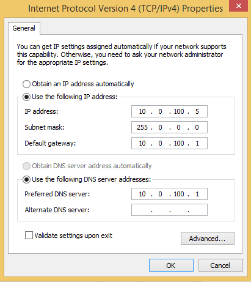
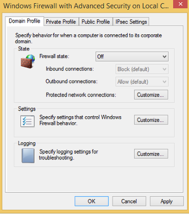

FMS Computer Configuration
==========================

Only complete these steps after completing the previous setup requirements.

Network Adapter
---------------

Configure the network connections for the Ethernet port of the FMS computer.

Set the IP address to 10.0.100.5, Subnet mask to 255.0.0.0, Default gateway to 10.0.100.1, and Preferred DNS server to 10.0.100.1.

Disable the wireless adapter (bluetooth, WiFi, and any others) if installed.

Firewall
--------

Disable all firewall settings on the FMS computer. Select Windows Firewall from the Control Panel; Advanced Settings; Windows Firewall Properties.

For Domain Profile, Private Profile, and Public Profile select Firewall state of Off.

Driver Stations and Robots
--------------------------

Robots and driver stations should be configured to use DHCP to obtain IP addresses.
