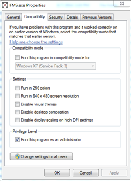
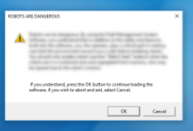

.. include:: <isonum.txt>
.. _off-season-installation:

Installation
======================

Retrieve Installer
------------------
.. note::
    FMS Off-Season shoud not be installed on top of a previous version. Please completly remove the old version before continuing. For help on doing this, please 
    :ref:`see this article <off-season-upgrading>`

In order to install FMS Off-Season, download the EXE file from the *FIRST*\ |reg| website. The file contains the necessary pre-requisites and is usually around 600 MB in size.

Access the Installer download `from this site <https://usfirst.collab.net/sf/projects/offseasonfms/>`_ (look for the most recent available)

FMS require a 64 bit Windows OS. *FIRST* recommends Windows 10.

Installation Process
--------------------

Depending on your machine settings, Windows may prevent the file from running since it was downloaded from the Internet. To do this, right click on the Installer file and select "Properties." On the Properties menu, select "Unblock" and "OK." Then, attempt to run the installer by double-clicking.

By default, FMS will utilize port 80 (localhost) for its Web Portal. If you need FMS Off-Season to operate on a different port, please see the section about using an alternate port. For most users, the normal installation instructions should be sufficient.

* Double-click the FMSOffSeasonInstaller_x.xx.exe to open the installation wizard.

Read the license terms. If you agree to the terms, click the box and select the Install option. You can specify the install path using the Options button. By default, the program will install in:

.. code-block:: text

    C:\Program Files\FIRST\FMSExeOffseason (64 bit OS)

The install button may bring up the User Account Control box depending on your version of Windows. If so, select Yes to grant FMS Off-Season access to install.

The FMS Off-Season installer will run and Windows will provide feedback on the progress.

When the installation finishes, you can close the installer.

Desktop Icons
-------------

The installer will place an icon on the desktop. The FMS icon (red arrow) will open the Event Manager (which includes the wizard that walks through the event, the control to turn robots on and off, etc).

The Audience Display, which will display scores and team information (as well as playing game sounds), will additionally add an icon if you elect to install it. For more information, :doc:`see this article <../../audience-display/configuration/installation>` .

Uninstalling
------------

To uninstall the software, use the Programs and Features option on the control panel and select “FMS Off-Season”, repair and uninstall options will be presented. SQL Server Express must be uninstalled separately if desired. Uninstalling and reinstalling FMS Off-Season will recreate the database. Be sure to create a backup of the database before uninstalling if you would like to retain the contents of the database.

Run as Admin
------------

Right click on the FMS icon (red arrow) on the desktop and select Properties. Under the Compatibility tab, click the box next to “Run as an administrator” and select OK.

Launching FMS
-------------

Once FMS Off-Season is installed, you should see a shortcut on your desktop to “FMS”. FMS requires administrative privileges on the machine in order to run properly. Make sure you have configured administrative privileges as described previously for the FMS shortcut.

Launch FMS Off-Season by double-clicking on the FMS shortcut. If you are prompted by “User Account Control,” select Yes to give FMS access to run on your machine.

Once FMS is loaded you must agree to a safety warning. Beyond that, refer to the :ref:`FMS User's Guide <event-wizard-navigation>` for additional operating instructions.

Launching Audience
------------------

Double click the "Audience Display" shortcut on your desktop to launch the Audience Display. The audience display will appear with the a background screen and game logo visible.
Only open the Audience Display after configuring an event through FMS Event Wizard.

See the Audience Display information in the :ref:`Audience Display User's Guide <audience-index>` documentation for additional details about using the Audience Display. 

.. note::
    Note: The Audience Display must be running in order to hear game sounds.

Audience Compatibility Mode
---------------------------

The Audience Display should run properly with no advanced configuration. You only need to follow these instructions if you encountered trouble running the program out of the box.

If you have trouble running the Audience Display in its default configuration, you may need to use compatibility mode. Open the location where you installed FMS, which is usually something similar to:

.. code-block:: text

    C:\Program Files (x86)\FIRST\AudienceDisplayExeOffseason (64 bit OS)

Right click on AudienceDisplay.exe and select Properties. Under Compatibility, select "Run this program in compatibility mode" and pick "Windows XP (Service Pack 3)" from the dropdown box.

Select OK. When you re-launch the Audience Display using the shortcut on your desktop, it should run properly.

If you wish to utiize a remote audience display, please see the appropriate configuration instructions in the User's Guide. It is recommended to run no more than two (2) instances of the Audience Display at any given time.

Advanced Installation
---------------------

By default FMS will use port 80 (localhost) for its Web Portal. However this can be changed if you need FMS to use another port. If you install on another port, you would need to change the references in the documentation to match.

Using a command line navigate to the folder which contains the FMS Off-Season Installer. The only user-configurable installation option for FMS is WebSitePort. Invoke the installer with the WebSitePort argument specifying the port you would like to use. For example, to invoke the installer with the default port (80) you would use the following command (you may need to change the name of the .exe file in this example):

FMSOffSeasonInstaller.exe WebSitePort=80

Proceed with the installation as described previously.

Shutting Down
-------------

To shut down the FMS application, simply click the "X" in the upper right. Only do this if a match is not running.

To shut down the Audience Display application, simply click "Alt+F4" when the application is in the foreground. Alternately, right click on the icon in the taskbar and selecting "Close Window."
