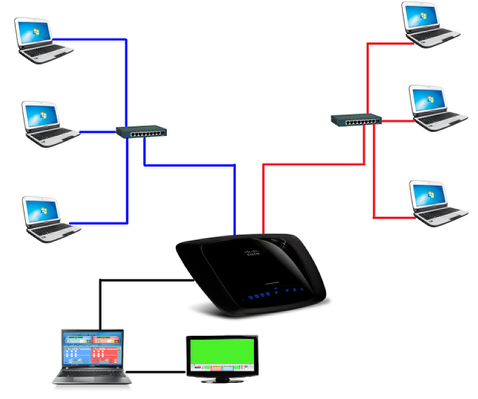

.. include:: <isonum.txt>

Network Hardware Configuration
==============================

Preparing the network for Off-Season events

Layout
------

Because FMS Off-Season is used at off-season events, the typical FRC\ |reg| field, electronics and hardware are not normally available. As such, the host team or organization will need to provide some basic network hardware in order to run the event. If you event has the full official electronics, you should not use FMS Off-Season, you must use the official FMS build in order to talk to network hardware.

At a very basic level, the Field Management System consists of a router, switches and a laptop/desktop with the FMS software. In the above diagram, the six driver station computers can be seen connected to switches on either side of the field (shown with red and blue lines). The switches are then connected to the router, which usually resides on the scoring table. In most scenarios, the red drivers should be on the right of the scorekeeper, as that is the way the software is configured to appear visually. In the above diagram, an external monitor (such as a projector or TV) is connected to the FMS machine and used to show the Audience Display. See below for more details about the wiring.

Wiring
------

In order to operate an event effectively, you will need some basic cabling between the field hardware. Use the basic field diagram from the previous section as a reference. The three driver station machines on each end of the field are connected to a switch, which is typically placed under the middle driver station, using CAT6 Ethernet cables. Depending on your venue, the cables may need to be 15-20 feet. Each switch, one for the red alliance and one for the blue alliance, will need a CAT6 Ethernet cable to run along the side of the field to the scoring table. These cables should be at least 50-75 feet in order to reach the full distance. The router will also need a CAT6 Ethernet cable to the machine that is running FMS Off-Season.

While CAT6 cables are recommended, CAT5e also work.

Router and Computer Configuration
---------------------------------

The router and FMS Computer must also be configured. See the next article for instructions.
